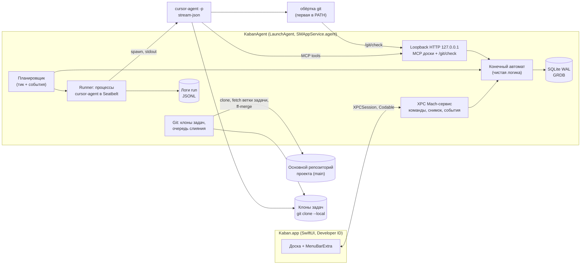

# Kaban: архитектура MVP (черновик v0.11.23)

Автор: Kaban Architector Bot · 3 октября 2026 · статус: на обсуждение, до утверждения Артёмом

Решения, на которых стоит документ: macOS 26 минимум; Swift-демон через launchd и тонкий SwiftUI-клиент; одна SQLite через GRDB на все проекты; агент в MVP только Cursor CLI; MCP доски по HTTP на loopback с токеном на запуск; Developer ID без App Store; изоляция задачи через `git clone --local`; слияние локально в `main`; бюджета в долларах в MVP нет; стадии абстрактные и задаются `.kaban/pipeline.yaml`; в Human Review сводка изменений и «Открыть в Cursor» вместо своего диффа.

**Этот документ — единственный источник набора статусов (раздел 3.2) и XPC-команд (раздел 5).** Спека фич и юзеркейсов на них ссылается.

Пометка **[спайк N]** — проверяем прототипом на Маке до старта разработки (раздел 14).

## 1. Процессы и границы



- **Kaban.app** — тонкий клиент: рисует доску, шлёт команды, получает снимок и события. Закрытие окна или падение UI не влияет на работающие задачи. Приложение стоит в автозапуске как менюбар-аппка и шлёт уведомления (раздел 12).
- **KabanAgent** — демон внутри бандла (`Contents/Library/LaunchAgents/…plist`), регистрируется через `SMAppService.agent`, объявляет `MachServices`. Вся логика и всё состояние здесь, единственный писатель в БД.
- **cursor-agent** — внешний процесс на каждую попытку стадии, свой process group, cwd = клон задачи, запуск внутри профиля Seatbelt.
- `kabanctl` — CLI поверх того же XPC, для отладки и скриптов, с первого дня.

## 2. Swift-пакет `Kaban` (репозиторий, `Package.swift` в корне)

| Модуль | Что внутри | Зависит от | Платформа |
|---|---|---|---|
| `KabanProtocol` | XPC: команды, ответы, снимок, события с `seq`, эфемерные события, `AgentEvent` | Foundation | macOS + Linux (Codable) |
| `KabanKit` | модель (Task, Stage, Pipeline, Run), валидатор `pipeline.yaml`, резолвер итоговой git-политики стадии (`GitPolicyResolver`); машина состояний `reduce(state, command) -> (state, [effect])`, WIP, лимиты возвратов, ретраи. Статусы и причины берёт из `KabanProtocol`, своих копий не заводит | `KabanProtocol` | macOS + Linux |
| `KabanDaemonCore` | GRDB: схема, миграции, журнал; планировщик, справедливый обход проектов, фейковый драйвер | `KabanKit`, GRDB | macOS + Linux |
| `KabanAgentDrivers` | `AgentDriver` + `CursorCLIDriver` (аргументы, парсер stream-json → `AgentEvent`) | `KabanProtocol` | macOS + Linux |
| `KabanHTTP` | loopback-сервер: MCP доски и `/git/check` | `KabanDaemonCore` | macOS + Linux |
| `KabanGit` | клоны задач, fetch, rebase, ff-merge, diffstat, снимки refs | Foundation | macOS + Linux |
| `KabanBoardCore` | состояние доски в приложении: применение снимка и событий, набор проектов (`BoardSetStore`), фильтры, оптимистичные команды | **только `KabanProtocol`** | macOS + Linux |
| `KabanGitShim` (executable) | обёртка `git` для PATH агента | — | macOS |
| `KabanDaemon` (executable) | сборка всего, Seatbelt, launchd, XPC listener | всё демонное | macOS |
| `KabanApp` (Xcode) | SwiftUI | `KabanProtocol`, `KabanBoardCore` | macOS |

Граница: приложение не импортирует `KabanKit` и GRDB. Правда о задачах и валидности пайплайна живёт в демоне; черновик пайплайна приложение проверяет командой `validatePipeline` (ответ и эфемерное `pipelineDraftValidated`), а не своей копией валидатора. Всё, что демон разрешает из `pipeline.yaml` (умолчания возвратов, итоговая git-политика стадии `StageSummary.gitPolicy: EffectiveGitPolicy?`), приходит готовым: для `main` в `PipelineSummary`, для черновика в `PipelineDraftValidation.resolved` (`nil`, если черновик не разобрался). Типы `EffectiveGitPolicy`, `GitRule`, `GitRuleSource`, `ConditionalGitRule`, `HardInvariant`, `StageCommitter` живут в `KabanProtocol`, сам резолвер только в `KabanKit`. Маскот рисует приложение (`KabanBoardCore`) по `ProjectSummary.mascotSeed` (по умолчанию сид = id проекта; пикер предлагает только маскотов из кита и подбирает сид `<projectId>#k`, `setMascot` хранит сид; порядок добавления для правила коллизий хранит `BoardSetStore`); генератора в `KabanKit` нет (v0.11.6). Модули `KabanModel`/`KabanStateMachine`/`KabanStore`/`KabanScheduler` из v0.11 слиты в `KabanKit` и `KabanDaemonCore` (v0.11.1).

Всё, кроме трёх macOS-модулей, собирается и тестируется на общем Linux-компьютере, пока Мак не в сети.

## 3. Конечный автомат

### 3.1 Пайплайн из конфига

Автомат строится из `.kaban/pipeline.yaml`. В коде только **типы** стадий и правила статусов; набор, порядок и настройки стадий — из конфига. `Backlog → Dev → Test → AI Review → Human Review → Merge → Done` — шаблон по умолчанию.

| kind | Что делает | WIP | агент | гейты | возврат назад |
|---|---|---|---|---|---|
| `queue` | Backlog | нет | нет | нет | нет |
| `agent` | запуск харнеса | да | да | да | по `returns_to` |
| `gate` | только команды без ИИ (на доске — тонкая полоса) | да | нет | да | по `on_fail` |
| `human` | решение человека | опционально | нет | нет | да (любая предыдущая стадия) |
| `merge` | очередь слияния, ровно одна на пайплайн | 1 | нет | да (после rebase) | по `on_conflict` |
| `terminal` | Done | нет | нет | нет | нет |

```yaml
version: 1
board:                              # правила процесса проекта; ресурсы Мака здесь не задаются
  max_waiting_human: 3              # на проект
  bounce_limit_total: 5
  max_runs_per_task: 12             # только автоматические запуски, см. 3.2
workspace:
  warm_paths: [node_modules, .gradle]
  on_create: "npm ci --prefer-offline"
git:                                # политика проекта (вкладка git в настройках проекта), 8.4
  preset: standard                  # strict | standard | permissive
  allow: []                         # дополнения к пресету
  deny:  []                         # сужения пресета; жёсткие инварианты не перечисляются, они всегда действуют
suspicious_files:                   # проверка всего diff ветки задачи, 8.2
  patterns: [".env*", "*.pem", "*.key", "*.p12", "id_rsa*", "id_ed25519*"]
  max_file_mb: 5
  allow: [".env.example"]           # пути, которые проект считает нормальными
stages:
  - id: dev                         # стабильный id, на него ссылается SQLite
    name: Разработка
    kind: agent
    display: { icon: hammer, color: blue, order: 2, collapsed: false, hidden: false }
    wip: 3
    priority: [returned, answered, fifo]
    agent:
      harness: cursor-cli
      model: <model-id>               # обязательно, явный id из `--list-models`; `auto` запрещён
      skill: .kaban/skills/dev.md
      permissions: write            # write | read-only
      mcp: [kaban]                  # сервер доски всегда; прочие MCP — только из белого списка проекта (9)
      env: { NODE_ENV: test }       # без секретов; секреты только по имени ключа Keychain
      workspace: task               # task | fresh-readonly
    git: { extend: [rebase], when: return_reason == merge_conflict }   # только переопределения стадии поверх политики проекта
    inputs: [task, handoff, return_issues, gate_output, git_grants]
    gates: ["./gradlew build", "./gradlew test"]
    on_success: test
    returns_to: []
    retry: { max_attempts: 3, backoff: [30s, 2m] }   # пауз на одну меньше, чем попыток (утверждено)
    timeouts: { stall: 10m, wall: 60m }
    hooks: { on_enter: null, on_exit: null }
    notify: [waiting_human]
  - id: test
    kind: agent
    on_success: ai-review
    returns_to: [{ stage: dev, limit: 3 }]
  # ...
```

**Источник правды — закоммиченный `main:.kaban/`.** Демон читает `git show main:.kaban/pipeline.yaml`, а не файл на диске, поэтому переключение ветки или незакоммиченная правка в рабочей копии человека правила не меняют. Копии в клонах задач игнорируются, а проверка результата (8.2) отклоняет любые изменения агента в `.kaban/`.

**Запись.**
- Из настроек UI: приложение атомарно пишет файл и вызывает `updatePipeline(projectId, contentHash)`. Демон синхронно валидирует и, если всё в порядке, автокоммитит `git commit --only -- .kaban/` под блокировкой очереди слияния проекта; ответ — либо новая версия, либо список `ValidationIssue`. Остальные правки человека в рабочей копии не трогаются.
- Ручная правка файла: FSEvents ловит изменение, демон валидирует и публикует состояние «есть незакоммиченные правки пайплайна» с результатом проверки. Молча не коммитим: в настройках кнопка «Применить» (тот же `updatePipeline`), либо человек коммитит сам.
- Новый проект без `.kaban/`: в диалоге добавления галочка «создать шаблон и закоммитить» (по умолчанию включена). Моделей по умолчанию нет: шаблон коммитится с пустыми `model:`, и проект сразу получает `unavailable: pipeline_invalid` со списком стадий без модели. Без закоммиченного пайплайна проект добавляется, но задачи не запускаются, на дорожке плашка «нет пайплайна». Задачи в Backlog создавать можно в обоих случаях.
- Чистая рабочая копия для добавления проекта не нужна.

**Валидация** (JSON Schema + семантика в `KabanKit`). Ошибки — `ValidationIssue { path: "stages[2].wip", stageId?, code, message, severity, params }`, путь к полю и стадия для подсветки в настройках. Коды (enum в `KabanProtocol`): `yaml_syntax`, `duplicate_id`, `unknown_stage`, `on_success_cycle`, `git_hard_invariant`, `model_missing`, `model_auto_forbidden`, `wip_out_of_range`, `no_return_target`, а также коды разбора и границ (`type_mismatch`, `missing_field`, `unknown_key`, `invalid_value`, `limit_out_of_range` и др., полный список с описаниями в `ValidationCode`). `params: [String: String]` — подстановки для текста кода из словаря спеки §4.1 (`line`, `n`, `min`, `max`, …); клиент собирает текст из словаря и `params`, а без перевода или при пустых `params` показывает `message` как есть, неизвестный код — общей строкой с кодом. Цвет и блокировку «Сохранить» клиент берёт по `severity`, а не по коду. `updatePipeline` некорректную версию не коммитит, «Сохранить» в UI при ошибках неактивна, черновик живёт только в редакторе. Если некорректная версия попала в `main` ручным коммитом, проект получает `unavailable: pipeline_invalid`: идущие runs доигрывают, новые не стартуют и задачи не переходят между стадиями, флаг гаснет сам, когда в `main` появляется корректная версия (правило «работаем на последней валидной» с v0.10 снято).
- `id` уникальны; одна `queue`-стадия входа, одна `merge`, есть `terminal`;
- `terminal` достижим по `on_success` из каждой стадии, циклов по `on_success` нет;
- `returns_to` указывает только назад по цепочке `on_success`; у `gate`-стадии возврат задаёт `on_fail { stage?, limit = 3 }`, у `merge` — `on_conflict { stage?, limit = 2 }`. Блок необязателен: без него действуют умолчания, гейт на месте не повторяется. **Цель любого возврата** (`returns_to`, `on_fail`, `on_conflict`, `requestChanges.target`) — только `agent`-стадия с `readOnly = false`: read-only стадия код не правит. Без `stage`: для `on_fail` — ближайшая предыдущая по цепочке `on_success` такая стадия, для `on_conflict` и `requestChanges` — первая такая стадия (после конфликта задача заново проходит все стадии, §8). Нет подходящей цели, явная цель read-only или явная цель не `agent`-стадия (например, `returns_to: backlog`) → ошибка валидатора `no_return_target` со `stageId` стадии, у которой возврат (несуществующий id — `unknown_stage`); если в пайплайне есть `human`-, `gate`- или `merge`-стадия, а `requestChanges` вернуть некуда, — `no_return_target` уровня пайплайна, без `stageId`; ручной `requestChanges` или `reject` в стадию, которая не `agent` с `readOnly = false`, → `invalid_state` (`reject` в `cancel` разрешён всегда) (`moveTask` на read-only стадию разрешён, это не возврат). Демон отдаёт в `StageSummary.onFail` / `onConflict` уже разрешённую цель и лимит, а умолчание `requestChanges` (Human Review и лист «Вернуть…» на любой стадии) — в `PipelineSummary.defaultReturnStage` (`nil`, если цели нет); клиент умолчания не вычисляет; лист «Вернуть…» показывает в «Куда» только допустимые цели и всегда шлёт `target`/`stage` явно; превышение `on_fail.limit` → `waiting_human: bounce_limit`, `on_conflict.limit` → `conflict_limit`;
- **нельзя удалить стадию, в которой есть задачи в нетерминальном статусе** (включая `queued`);
- у **каждой** `agent`-стадии явная `model`, не `auto`; хоть одна стадия без модели делает некорректным весь пайплайн;
- `wip ≥ 1`, таймауты и лимиты в границах, пауз в `backoff` не больше `max_attempts − 1`; харнес из поддерживаемых; в `env` нет похожего на секреты.

Модель, которой нет в `model_catalog`, валидацию не ломает (каталог может отставать): она даёт флаг модели `unavailable` (3.2), а не ошибку пайплайна.

**Версии.** Валидная версия сохраняется снимком в `pipeline_version` (хэш, JSON). Задача при входе в стадию запоминает хэш, идущий run доживает по своему снимку, новые берут текущую. Урезание WIP ниже текущего числа задач никого не убивает, просто новые не стартуют. Уменьшение лимита возвратов ниже набранного — задача доходит стадию, на следующем возврате уходит к человеку.

### 3.2 Статусы (единый набор)

Задача всегда находится в стадии (`stage_id`) и имеет ровно один `status`. Отдельного `failed` нет: всё, что требует решения, это `waiting_human` с причиной.

| status | Смысл | Занимает execution WIP стадии | Считается в `max_waiting_human` |
|---|---|---|---|
| `queued` | ждёт слота в стадии (в Backlog — ждёт отправки в работу) | нет | — |
| `running` | идёт run агента | да | — |
| `gating` | идут гейт-команды (после `complete_stage`, в `gate`- и `merge`-стадиях) | да | — |
| `retry_wait` | пауза перед повтором (backoff или cooldown rate-limit) | да | — |
| `waiting_human` | нужен человек, см. `reason` | нет; human admission описан ниже | да, кроме `reason = review` |
| `paused` | человек поставил на паузу эту задачу | нет | — |
| `blocked` | не может идти по внешней причине, см. `reason` | нет | — |
| `done` | дошла до `terminal` | нет | — |
| `cancelled` | отменена или отклонена человеком | нет | — |

**WIP `human`-стадии** (v0.11.23): занимают все уже допущенные нетерминальные задачи стадии, кроме `queued`, включая `paused` и `waiting_human` с любой причиной; ждущие места стоят в самой стадии как `queued: wip_full`. В протоколе — `occupiesWIP(in: StageKind)`. Демон отдаёт готовую загрузку: `stageLoad [{ projectId, stageId, wipUsed, wipLimit? }]` в снимке и журнальное событие `stageLoadChanged` в той же транзакции, что и `taskUpdated`; UI сам WIP не считает.

Причины (`reason`, enum):
- `waiting_human`: `question` (агент вызвал `request_human`), `review` (задача в `human`-стадии), `retries_exhausted`, `bounce_limit`, `conflict_limit`, `run_limit` (превышен `max_runs_per_task`), `model_substituted` (Cursor ответил не той моделью, 6.4), `git_denials` (5 отказов политики за run), `incident` (проверка результата нашла нарушение), `suspicious_files` (в diff ветки есть подозрительные файлы, 8.2), `invalid_result` (read-only стадия оставила изменения).
- `queued` (не статус ошибки, а подпись на карточке): `wip_full` («Ждёт места»), `quota_cm` / `quota_om` (остаток пула ниже порога, 7), `model_flag` (на модели стадии висит флаг). Задача с такой причиной не держит очередь: планировщик берёт следующую в стадии.
- `retry_wait`: `crash`, `stall_timeout`, `wall_timeout`, `no_final_call`, `gate_failed`, `readonly_violation`; без списания попытки: `rate_limit` и `runner_auth` (ждут снятия глобального флага), `daemon_restart`, `silent_exit` (выход без единого вызова инструмента и без изменений, ждёт пробного запуска, 6.4).

**Счётчики.** Попытки (`max_attempts`) считаются в пределах одного захода в стадию и обнуляются при возврате или новом входе. `max_runs_per_task` считает все автоматические runs задачи, кроме тех, что не списывают попытку (`rate_limit`, `runner_auth`, `daemon_restart`, `silent_exit`, остановка по `model_substituted`); любое действие человека над задачей (`answerHuman`, `retryStage`, `moveTask`, `requestChanges`, `reject` в стадию) обнуляет его. Ретрай, упёршийся в квоту или флаг модели, освобождает WIP-слот и уходит в `queued` с причиной, попытку не списывает.
- `blocked`: `main_dirty` — только задача в голове очереди слияния, когда ff-merge упёрся в пересекающиеся правки человека.

Всё, что касается целого Мака или целого проекта, — **флаги планировщика**, а не статусы задач: задачи остаются `queued`, новые runs не стартуют, текущие доигрывают.

| Уровень | Флаг | Причины | Где показывается | Снимается |
|---|---|---|---|---|
| Мак | `paused` | `manual` | баннер над доской | `resumeAll` |
| Мак | `rate_limited` | — (короткий лимит, cooldown 15 → 30 → 60 мин) | баннер над доской | по времени или `resumeAfterRateLimit` |
| Мак | `usage_exhausted` | `unknown` (кончилась месячная квота, но неизвестно, какой пул) | баннер над доской с датой сброса | по `billingCycleEnd` или дате из текста ошибки; если дата неизвестна — пробный запуск раз в 6 ч или вручную |
| Пул | `usage_exhausted` | `cm`, `om` (известно, какой пул кончился) | баннер «Om исчерпан · N стадий» и знак в шапках столбцов на моделях этого пула | так же, как на уровне Мака |
| Мак | `runner_unavailable` | `agent_missing`, `agent_not_runnable` (не отвечает `--version`), `agent_not_logged_in`, `runner_auth` (run упал с ошибкой авторизации) | баннер над доской, «Проверить снова» | успешная проверка |
| Проект | `paused` | `manual` | шапка дорожки | `resumeProject` |
| Проект | `intake_paused` | `max_waiting_human` (только забор из Backlog) | шапка дорожки | автоматически |
| Проект | `unavailable` | `project_missing`, `no_pipeline`, `pipeline_invalid` (в т. ч. стадия без модели), `mcp_unexpected` (CLI видит MCP-сервер вне собранного конфига, 9) | шапка дорожки, «Проверить снова» | автоматически или `recheck` |
| Проект | `merge_blocked` | `main_dirty` | шапка дорожки + задача `blocked: main_dirty` | автоматически после очистки |
| Модель | `model_flag` | `unavailable` (пропала из `--list-models` или `resource_exhausted`), `substituted` (6.4) | тонкий баннер «Opus недоступен · N стадий» над доской и знак в шапках этих столбцов | проба на модели (одна на модель, не чаще раза в 10 мин) с ожидаемым именем в `init`, появление в каталоге или `clearModelFlag` |

Флаг модели останавливает только стадии с этой моделью; задачи на других моделях идут дальше.

Проверка раннера: при старте демона, раз в 5 минут и по `recheck`: бинарь по сохранённому пути, ответ `--version`, статус входа без запуска модели (какой командой — **[спайк 1]**). Реактивно: ошибка авторизации в run сразу включает `runner_unavailable: runner_auth` на весь Мак, а run уходит в `retry_wait: runner_auth` без списания попытки (бэк), чтобы разлогин за ночь не сжёг ретраи всей доски. Отдельно состояние карточки показывает бейджи, которые статусом не являются: счётчики возвратов (`2/3`), пересечение файлов с другой задачей, наличие неиспользованного git-разрешения.

У `run` свой статус: `starting → running → (succeeded | failed | killed)` и `end_reason` (те же значения, что причины `retry_wait`, плюс `completed`, `returned`, `asked_human`, `paused_by_human`, `moved_by_human`).

### 3.3 Переходы

| Команда / событие | Кто | Эффект |
|---|---|---|
| `start_run` | планировщик | `queued → running`, создаёт run |
| `complete_stage(summary, artifacts)` | агент (MCP) | `running → gating` |
| `gate_passed` / `gate_failed(output)` | демон | → `queued` следующей стадии / на `agent`-стадии `retry_wait: gate_failed` (попытка списывается); на `gate`-стадии — возврат по `on_fail` (§3.1), на месте не повторяется |
| `return_to_stage(target, issues[])` | агент (MCP) | → `queued` целевой стадии, счётчик причины +1 |
| `request_human(question)` | агент (MCP) | → `waiting_human: question`, сессия сохраняется |
| `run_exited` без финального вызова | демон | → `retry_wait: no_final_call` |
| `timeout(stall|wall)`, `crash` | демон | убить process group, грязное состояние клона сохранить в `refs/kaban/wip/<run-id>` (внутри клона), откатить клон к последнему коммиту стадии, → `retry_wait` |
| `silent_exit` | демон | выход без вызовов инструментов и изменений → `retry_wait: silent_exit` без списания, пробный запуск на модели (6.4) |
| `model_mismatch` в `system/init` | демон | убить run до первого вызова инструмента, → `waiting_human: model_substituted`, флаг модели `substituted`, результат не принимается, попытка не списывается |
| `quota_below_threshold` перед стартом | планировщик | run не создаётся, задача остаётся/возвращается в `queued: quota_cm | quota_om` |
| превышен `max_runs_per_task` | демон | → `waiting_human: run_limit` |
| `rate_limit_detected` | демон | глобальный cooldown, этот run → `retry_wait: rate_limit` |
| исчерпаны `max_attempts` / лимит возвратов | демон | → `waiting_human` с причиной и сводкой |
| `answerHuman(text, requestId?)` | человек | на `agent`-стадии из `waiting_human` с любой причиной (иначе `invalid_state`) → `queued` своей стадии с приоритетом `answered`, resume сессии с текстом (**[спайк 1]**). Это и ответ на вопрос, и «Замечание агенту»; если попытки исчерпаны, добавляется одна попытка; счётчики возвратов не сбрасываются |
| `approve` | человек, `human`-стадия | → `queued` следующей стадии (Merge) |
| `requestChanges(comments, target?)` | человек | → `queued` указанной стадии (только `agent` с `readOnly = false`; по умолчанию `PipelineSummary.defaultReturnStage`, первая такая стадия), возврат в лимиты не входит; из `human`-, `gate`- и `merge`-стадий (в т. ч. из `bounce_limit` / `conflict_limit`, задача там и остаётся до решения); подозрительный набор не принимает |
| `reject(target, keepBranch?)` | человек | `target = cancel` → `cancelled`, как `cancelTask`; `target = <stage>` → в эту стадию, это возврат: только `agent` с `readOnly = false`, иначе `invalid_state` |
| `pauseTask` / `resumeTask` | человек | убить текущий run без списания попытки, → `paused` / обратно `queued` |
| `moveTask(stage)` | человек | перенос, не возврат: в любую стадию, в том числе read-only, без комментария и без правил возврата; текущий run убивается без списания |
| `retryStage(grantAttempts?)` | человек | из `waiting_human` → `queued`, при необходимости добавить попыток |
| `cancelTask(keepBranch?)` | человек | → `cancelled`; текущий run убивается, клон удаляется. С `keepBranch` демон сначала забирает ветку задачи из клона в основное репо как `kaban/archive/<task-id>` и сразу добавляет этот ref в `refs_snapshot`; без флага в основном репо ничего не остаётся |

`complete_stage` никогда не двигает задачу сам: дальше её переводит демон после зелёных гейтов и проверки результата (8.2).

### 3.4 Планировщик (все проекты)

Два уровня настроек: процесс команды в `pipeline.yaml` (стадии, WIP, лимиты возвратов, `max_waiting_human`, git-политика) и ресурсы Мака в локальной БД (`max_concurrent_runs`, по умолчанию 4; вес проекта и личный максимум; маскот).

Флаги планировщика — таблица в 3.2. Очередь слияния своя у каждого проекта.

Цикл (по событию и по таймеру):
1. Reconciliation: сверить живые процессы с runs, обработать таймауты, разбудить `retry_wait`, у которых истёк backoff или cooldown.
2. Применить флаги планировщика (3.2). Текущие runs всегда доигрывают.
3. Кандидаты: в каждом активном проекте для каждой стадии со свободным WIP — первая задача по `priority` стадии; стадии от конца конвейера к началу.
4. Слоты делятся между проектами взвешенным круговым обходом (deficit round robin) с учётом личных максимумов; курсор обхода в БД.
5. Выбор и старт run — одна транзакция с проверкой WIP и глобального потолка.

## 4. Хранилище

`~/Library/Application Support/Kaban/kaban.sqlite`, WAL, один писатель. Во всех таблицах `project_id`.

- `project` — стабильный id, путь и bookmark папки, базовая ветка, вес, личный максимум, маскот, `available | missing`;
- `settings` — `max_concurrent_runs`, курсор обхода, состояние пауз и cooldown; опция квоты (выключена, согласие, время согласия), интервал опроса (1, 5, 15, 30 мин или своё), пороги Cm и Om (по умолчанию 10%);
- `pipeline_version` — снимки валидных версий;
- `task` — `stage_id`, `status`, `reason`, хэш версии пайплайна при входе в стадию, приоритет, `bounce_by_reason`, ветка, путь клона, `session_id` для resume;
- `run` — попытка: стадия, номер, pid, pgid, время старта процесса, запрошенная модель (id) и фактическое имя из `init`, `counts_toward_limits`, статус, `end_reason`, exit code, usage, путь к логу, счётчик git-отказов;
- `git_grant` — разовые git-разрешения (раздел 8.3);
- `incident` — `task_id`, `run_id`, вид нарушения (`refs_moved`, `tags_changed`, `config_changed`, `kaban_dir_changed`, `foreign_base`), что откатили, `opened_at`, `resolved_at`, `resolved_by_command`. Инцидент закрывается сам в той же транзакции, где применённая команда человека выводит задачу из `waiting_human: incident` (`answerHuman`, `retryStage`, `moveTask`, `requestChanges`, `reject`, `cancelTask`);
- `task_accepted_file` — принятые человеком подозрительные файлы задачи: путь, blob, кто и когда (8.2);
- `refs_snapshot` — ожидаемые refs основного репозитория для проверки результата;
- `task_feed_item` — лента задачи (переходы, вопросы, отказы и разрешения git, инциденты, резюме); живёт столько же, сколько задача, и не обрезается вместе с журналом;
- `event` — append-only журнал синхронизации с глобальным `seq` (бывший `transition`): переходы задач, изменения проектов и настроек, применённые версии пайплайна, инциденты, git-отказы и разрешения. В `payload` — `commandId` команды-источника;
- `human_request`, `artifact` (резюме стадий, diffstat, вывод гейтов);
- `model_catalog` — `id`, `name` (отображаемое имя из `--list-models`), `pool`, `needs_review` («проверь пул»), `forbidden` (`auto`), `seen_at`, `missing_since`; сверяется с CLI при старте демона и раз в сутки;
- `model_pool_rule` — `pattern`, `pool` (`cm | om`), `source` (`builtin | user`); встроенное правило одно: `composer-*` → Cm, остальное → Om; ручные исключения Артёма;
- `model_flag` — `model_id`, `reason` (`unavailable | substituted`), `requested`, `actual?` (только при `substituted`), `fallback_model`, `since`, `last_probe_at`;
- `quota_sample` — время, `cm_percent`, `om_percent`, `billing_cycle_end`, число runs в пуле (для оценки среднего расхода);
- `project_mcp_allow` — белый список MCP проекта: имя сервера, источник (`project | personal`).

Каждая команда — одна транзакция: запись в `event` + обновление проекций. Логи stream-json — в `Logs/<run-id>.jsonl`, в БД путь и счётчики. Журнал `event` нужен только для досылки клиенту и обрезается (30 дней или N событий); история задачи берётся из `task_feed_item`, `artifact`, `run`, `git_grant`, `human_request` через `getTaskDetail` (раздел 5).

## 5. XPC-протокол

`XPCSession` / `XPCListener`, сообщения Codable из `KabanProtocol`. Listener принимает только клиента, подписанного нашим Team ID.

**Синхронизация.**
- `getSnapshot(projectIds?) -> Snapshot { seq, projects, pipelines, tasks, schedulerFlags, modelFlags, quota?, openIncidentCount, stageLoad, settings? }` (`openIncidentCount` — сумма `ProjectSummary.openIncidentCount`) — состояние доски на момент `seq` (карточки, без лент). Карточка несёт `suspiciousFiles` — текущий непринятый набор (не пуст только в `waiting_human: suspicious_files`), поэтому он переживает перезапуск и `resyncRequired`; принятые файлы (`acceptedFiles`: путь, blob, кто, когда) — в `TaskDetail`.
- `getTaskDetail(taskId) -> TaskDetail { seq, task, feed, runs, artifacts, gitGrants, gitDenials, humanRequests, suspiciousFiles, acceptedFiles, clonePath? }` — всё для панели деталей из долговечных таблиц, не из журнала; дальше панель обновляется событиями этой задачи с `seq` больше полученного.
- `subscribe(fromSeq, projectIds?)` — досылка из `event` после `fromSeq`, затем живые события. Если `fromSeq` старше хранимого журнала — сигнал `resyncRequired`, клиент берёт снимок заново.
- Каждая команда несёт `commandId` (UUID от клиента); ответ содержит `commandId` и `seq` порождённого события, а журнальное событие — тот же `commandId` в `payload`. UI не делает оптимистичных переходов: карточка ждёт событие с этим `commandId`.

**Дополнение контракта 4 октября 2026 (решения #9–12, #14, #44).**

- `answerHuman` продолжает только `agent`-стадию из `waiting_human` с любой причиной; на остальных типах стадий возвращает `invalid_state`. Human Review использует `approve` / `requestChanges` / `reject`, gate/merge — разрешённые для состояния `retryStage` / `moveTask` / `requestChanges` / `cancelTask`. Ответ не принимает подозрительные файлы.
- Любое изменение агентом защищённого `.kaban/` (tracked/untracked содержимое, замена каталога или симлинка) — `kaban_dir_changed`: откат, долговечный инцидент, `waiting_human: incident`, без автоматического продолжения. Только явная применённая команда человека выводит задачу из этого ожидания. Редактирование человеком через `updatePipeline` является отдельной разрешённой операцией.
- Execution WIP agent/gate/merge следует `TaskStatus.occupiesWIP`; `waiting_human` агентский слот не занимает. Admission WIP human-стадии учитывает explicit persisted marker до выхода из стадии/final: waiting_human, paused после допуска и resumed queued после допуска удерживают место; queued/paused до допуска места не занимают. При снижении лимита никого не вытесняют, новые admission блокируются до освобождения. Human admission не расходует глобальный слот run.
- `ValidationIssue.path = ""` означает документ целиком, допустим для `yaml_syntax` и root `type_mismatch`. Клиент отображает его как `pipeline.yaml`; ошибки конкретного поля сохраняют непустой путь.
- Агрегаты инцидентов авторитетны в `ProjectSummary.openIncidentCount`, полученном из snapshot / `projectAdded` / `projectUpdated`. Демон публикует `projectUpdated` в той же транзакции, что открывает/закрывает incident. `incidentOpened` / `incidentResolved` обновляют детали и ленту, но клиент не увеличивает/уменьшает по ним счётчики. `Snapshot.openIncidentCount` и агрегат клиентской проекции равны сумме по проектам данного снимка/проекции; `projectRemoved` также пересчитывает сумму. Конечный результат не зависит от порядка событий внутри транзакции.

**Долговечные DTO деталей (#14).** `TaskDetail.artifacts: [TaskArtifact]`, `gitGrants: [GitGrantSnapshot]`, `gitDenials: [GitDenialSnapshot]` читаются из долговечных таблиц, а не восстанавливаются из обрезанного журнала. Отсутствующие/null коллекции старого ответа декодируются как `[]`; новые пустые коллекции не кодируются, сохраняя прежние golden fixtures. Существующие `humanRequests`, `suspiciousFiles`, `acceptedFiles` остаются обязательными массивами: отсутствие/null — ошибка декодирования.

- `TaskArtifact { id: ArtifactID, taskId, runId?, stageId?, kind: String, text, createdAt, path? }`. `kind` открытый (`summary`, `diffstat`, `gate_output` и будущие виды); неизвестный вид не теряет текст. `path` — локальная метаинформация, не разрешение на чтение.
- `GitDenialSnapshot { denial: GitDenied, at }` сохраняет payload и исходное время отказа.
- `GitGrantSnapshot { grant: GitGrantCreated, taskId, stageId, createdAt, delivery: GitGrantDelivered?, deliveredAt?, consumption: GitGrantRef?, consumedAt?, revocation: GitGrantRevoked?, revokedAt?, expiry: GitGrantExpired?, expiredAt? }` повторно использует journal DTO и их enum/ID. Доставка не списывает разрешение. Списание/отзыв/истечение прекращает возможность использования; server проверяет task/stage/нормализованный argv и hard invariants, grant никогда их не отменяет. `KABAN_RUN_TOKEN` и иные credentials в DTO не входят. Payload lifecycle и timestamp записываются атомарно; потребление, отзыв и истечение взаимоисключающие терминальные исходы.

**Начальные настройки клиента.** `Snapshot.settings: GlobalSettings?`; `nil` от старого сервера означает «настройки неизвестны», а не значения по умолчанию. `GlobalSettings { maxConcurrentRuns: Int, quotaOptions: QuotaOptions, quotaConsentedAt: Date? }` использует существующий typed `QuotaOptions`; обязательные значения поставляет daemon. `SettingsChange` сохраняет совместимые `key/value` и добавляет optional `settings: GlobalSettings` — авторитетный снимок после изменения. Клиент не выводит consent или числовые лимиты из строк и не подменяет отсутствие настроек defaults. Снимок и обновление настроек имеют одно представление и относятся к указанному `seq`.

Это контракт Codable, а не реализованные XPC handlers, чтение БД или живое исполнение команды. M1 store/scheduler с fake driver обязан сохранять полный TaskMachine state и pipeline snapshot входа в стадию; commandId dedup, обновление проекций, journal и effects outbox находятся в одной транзакции. Реальное исполнение git/process effects и их подтверждение остаются отдельной вехой.

**Журнальные события** (имеют `seq`, переживают переподключение): изменения задач и их статусов, проекты, настройки, версии пайплайна, инциденты, git-отказы и разрешения, вопросы и ответы.
**Эфемерные** (без `seq`, при переподключении приходят текущим значением в снимке): `schedulerFlagsChanged` (все флаги из 3.2 с причинами и временем cooldown), `modelFlagsChanged`, `quotaUpdated { cm?, om?, billingCycleStart?, billingCycleEnd?, fetchedAt }` (`nil` — «нет данных», а не 0%), `modelCatalogChanged`, результат проверки раннера, результат валидации ручной правки пайплайна, прогресс run, живой лог.

**Журнальные события задач, проектов и пайплайна** (формат на проводе `{ type, data }`, неизвестный `type` клиент пропускает): `taskCreated(TaskCard)`, `taskUpdated(TaskCard)` — полная карточка после любого изменения задачи, включая статус, счётчики и `suspiciousFiles`; клиент просто заменяет карточку, `taskTransitioned { taskId, fromStage, toStage, from, to, by, runId?, note? }` (`commandId` — в конверте) — переход для ленты и анимации, `taskEdited(TaskCard)`; `projectAdded(ProjectSummary)`, `projectUpdated(ProjectSummary)`, `projectRemoved(projectId)`; `pipelineApplied(PipelineSummary)`, `settingsChanged`; `humanRequested`, `humanAnswered`. Демон шлёт `taskUpdated` в той же транзакции, что и предметное событие (`suspiciousFilesFound`, `humanRequested`, …), поэтому карточку достаточно держать по `taskUpdated`, а предметные события нужны ленте и уведомлениям.

**Журнальные события git:** `gitDenied { denialId, taskId, runId, argv, rule }`, `gitGrantCreated { grantId, denialId, argv, by }`, `gitGrantDelivered { grantId, runId, via: mcp_response | next_prompt }` (агент получил уведомление о разрешении), `gitGrantConsumed { grantId, runId }`, `gitGrantRevoked { grantId, by }`, `gitGrantExpired { grantId, reason: task_done | task_cancelled }`, `gitPolicyUpdated { projectId, scope, pipelineVersion }`.

**Журнальные события подозрительных файлов:** `suspiciousFilesFound { taskId, runId?, stageId, files: [{ path, rule: pattern | size, pattern?, sizeBytes, isText, blob }] }` (`isText` — по `git diff --numstat`; «дифф» в UI при `isText` и размере меньше `max_file_mb`), `suspiciousFilesAccepted { taskId, files, by, commandId }`.

**Журнальные события инцидентов:** `incidentOpened { incidentId, projectId, taskId, runId, kind, rolledBack }`, `incidentResolved { incidentId, by, commandId }`.

**Живой лог.** Отдельный поток `tailLog(runId, fromOffset)` отдаёт уже разобранные `AgentEvent` (сообщение, tool call, результат, ошибка, usage) батчами раз в 100–250 мс; так UI не зависит от формата конкретного харнеса. Путь к сырому JSONL есть в run для «Открыть сырой лог».

**Команды.**
- Проекты: `addProject(path, createTemplate, identity?)` (без автора — `identity_required`, §8.2), `setProjectIdentity(projectId, identity)`, `removeProject`, `relinkProject(id, path)`, `listBranches(projectId)`, `detectGates(projectId)` (предложить гейты по файлам сборки), `setMascot`, `setProjectWeight(weight, maxRuns?)`.
- Пайплайн и политика: `updatePipeline(projectId, contentHash) -> PipelineVersion | [ValidationIssue]`, `validatePipeline(projectId, content)` (без записи, для живой проверки в настройках).
- Детали: `getTaskDetail(taskId)`.
- Задачи: `createTask`, `editTask` (только в `queued`/`waiting_human`/`paused`), `setPriority`, `moveTask(stage)`, `pauseTask`, `resumeTask`, `cancelTask(taskId, keepBranch = false)`, `retryStage(grantAttempts?)`, `setModelOverride(taskId, stageId, model)`.
- Человек: `answerHuman(taskId, text, requestId?)` (ответ на вопрос или «Замечание агенту» из любого `waiting_human` **только на `agent`-стадии**; на `human`, `gate`, `merge` — `invalid_state`, там действуют `approve` / `requestChanges` / `reject` / `retryStage` / `moveTask`), `approve(taskId)`, `requestChanges(taskId, comments, target?)`, `reject(taskId, target, keepBranch = false)` (`keepBranch` учитывается только при `target = cancel`). `acceptSuspiciousFiles(taskId, files: [{path, blob}])` — кнопка «Принять файлы»: принимает ровно показанный набор; если он уже изменился, ответ `stale_suspicious_files` и ничего не принято (8.2).
- Git: `allowGitOnce(denialId)`, `addDenialToPolicy(denialId, scope: .project | .stage(stageId))` (правка `.kaban/` через тот же путь, что `updatePipeline`), `revokeGitGrant(grantId)`.
- Планировщик: `pauseAll` / `resumeAll`, `pauseProject` / `resumeProject`, `resumeAfterRateLimit` (досрочно снять cooldown), `setMaxConcurrentRuns`.
- Среда: `checkEnvironment() -> { cursorAgentPath, version, authOK, gitVersion, sandboxOK, notificationsAuthorized }`, `recheck(scope: .runner | .project(id))` для кнопки «Проверить снова».
- Модели и квота: `listModels()` (каталог с пулами, без `forbidden`), `refreshModelCatalog()`, `setModelPoolRule(pattern, pool)` / `removeModelPoolRule`, `clearModelFlag(modelId)`, `setQuotaOptions(enabled, consent, pollInterval, thresholdCm, thresholdOm)`.
- MCP: `listProjectMcpServers(projectId)` (найденные в `.cursor/mcp.json` проекта и в личном конфиге), `setProjectMcpAllowlist(projectId, servers)`.
- Логи: `tailLog(runId, fromOffset)`, `getRunHistory(taskId)`.
- Инциденты: `listIncidents(projectIds?, state: .open | .all)` для раздела «Инциденты» в сайдбаре; отдельной команды «разобрать» нет.

Набор проектов на доске (упорядоченный список `projectId`, `BoardSetStore`) — состояние приложения, демону не нужно. Приложение подписывается на все проекты (`projectIds` = nil) и фильтрует на своей стороне, чтобы у скрытого проекта в сайдбаре оставались значки `waiting_human` и инцидентов.

## 6. Интеграция с Cursor

### 6.1 Драйвер
```swift
protocol AgentDriver {
  func makeInvocation(run: RunSpec) throws -> ProcessSpec   // argv, env, cwd
  func parse(line: Data) -> AgentEvent?
}
```
`CursorCLIDriver` — единственная реализация в MVP, протокол оставляет дорогу к Cursor SDK, Codex app-server, Claude и ACP.

Запуск (точные флаги — **[спайк 1]**): `cursor-agent -p --output-format stream-json --model <id> [--force] --approve-mcps "<prompt>"`, cwd = клон задачи, свой process group, внутри Seatbelt (8.2). `--model` передаётся **всегда**: без него CLI берёт Auto, а Auto в Kaban запрещён. `--approve-mcps` одобряет всё, что CLI видит, поэтому перед стартом демон собирает конфиг MCP сам и сверяет список серверов (9).

Промпт собирает демон: скилл стадии, задача, handoff-резюме, замечания возврата и гейтов, действующие git-разрешения, обязательство закончить `complete_stage` / `return_to_stage` / `request_human` и вызывать `report_progress` хотя бы раз в несколько минут.

Read-only стадия: без `--force`, политика git сужена до чтения; если после run в клоне есть изменения — откат, `retry_wait: readonly_violation` (попытка списывается, паузы как у `gate_failed`, в промпт добавляется замечание), второе нарушение за заход — `waiting_human: invalid_result` независимо от оставшихся попыток.

Следующая попытка после `gate_failed` и `no_final_call` продолжает работу в том же клоне, в промпт добавляются вывод гейта или напоминание закончить через `complete_stage`. После `crash` и таймаутов клон откатывается (3.3), а `refs/kaban/wip/<run-id>` человек может восстановить из панели деталей.

### 6.2 Окружение launchd
LaunchAgent не получает PATH из shell. Путь к `cursor-agent`, PATH и тулчейны демон берёт из своего конфига (детект при первом запуске через login shell, правится в настройках). Авторизация из-под launchd — **[спайк 1]**, запасной вариант `CURSOR_API_KEY` из Keychain в env процесса.

### 6.3 Коммиты
В пресетах «Стандартный» и «Свободный» агент коммитит в ветку задачи сам, а после зелёных гейтов демон делает страховочный коммит `kaban: <stage> <task>`. В «Строгом» агент не коммитит: после зелёных гейтов и проверки результата демон делает единственный коммит стадии из всего изменённого в клоне (фильтр — только `.gitignore`), сообщение — `summary` из `complete_stage`. Сводка Human Review: `git diff --stat base...branch`, коммиты, резюме стадий.

### 6.4 Классификатор сбоев и сверка модели
- **Сверка модели.** Фактическая модель приходит только в первом событии `system/init` и только отображаемым именем. Демон сравнивает его с `model_catalog.name` для запрошенного id. Совпало — дальше. Имя известно и не совпало — `model_substituted` (3.3): run убивается до первого вызова инструмента, клон чистый, в ленту и на карточку идут запрошенная модель (имя и id), ответившая модель, `fallbackModel` (если был в ошибке), время, номер run, ссылка на лог. Имени нет в каталоге или оно неоднозначно — серая строка `model_unconfirmed` в ленте, run продолжается. Подмену посреди сессии поток не показывает; что видно при `fallbackModel` и `--resume` — **[спайк 1]**.
- **Лимитные ошибки.** `usage limit` / `spendLimitHit` → `usage_exhausted` на пул модели run, а если пул не определить — на весь Мак (`unknown`) (дата сброса — `billingCycleEnd` из квоты или парсинг `chatMessage`); `resource_exhausted` / «not available in the slow pool» → флаг модели `unavailable`; прочий rate-limit → `rate_limited` с cooldown. Run, получивший ошибку, попытку не списывает.
- **Молчаливый выход** (ни одного вызова инструмента, ни одного изменённого файла) → `retry_wait: silent_exit` и пробный запуск: та же модель, короткий промпт, разбор вывода и debug-лога. Проба одна на модель за раз и не чаще раза в 10 минут. Нашлась лимитная причина — флаг по правилу выше (`usage_exhausted` на пул, если пул известен, иначе на Мак); проба прошла чисто — это обычный сбой, попытка списывается задним числом.
- Сигналы и фикстуры для фейкового драйвера — **[спайк 1]**.

## 7. Квоты

Бюджета в долларах в MVP нет, но usage (если CLI его отдаёт, **[спайк 1]**) пишется в `run` для будущих метрик.
- **Реактивная схема (всегда).** Лимитные ошибки разбирает классификатор (6.4): `rate_limited` с cooldown 15 → 30 → 60 мин, `usage_exhausted` на пул (на весь Мак только при `unknown`), флаг модели `unavailable` только для её стадий. Текущие runs доигрывают; run, получивший ошибку, попытку не списывает.
- **Проактивная проверка (опция, M4).** Выключена по умолчанию, включается с явным согласием, помечена «неофициально». Демон читает токен **только для чтения**: собственный токен `cursor-agent`, если **[спайк 1]** его найдёт (тогда проценты гарантированно того же аккаунта, IDE не нужна), иначе `cursorAuth/accessToken` из `~/Library/Application Support/Cursor/User/globalStorage/state.vscdb` (read-only). Токен живёт только в памяти, не пишется на диск, в лог и БД, демон его никогда не обновляет (иначе IDE разлогинится): протух — данных нет. Запрос один — `POST https://api2.cursor.sh/aiserver.v1.DashboardService/GetCurrentPeriodUsage`, без редиректов. Cm = `planUsage.autoPercentUsed`, Om = `planUsage.apiPercentUsed`, сброс = `billingCycleEnd` (строка с миллисекундами эпохи). Нет процента или `"enabled": false` — «нет данных», а не 0%. Начало цикла — `billingCycleStart`, если ответ его отдаёт (**[спайк 1]**), иначе календарно тот же день месяцем раньше. Сессия браузера и `usage-summary` не используются. Если чтение `state.vscdb` из-под LaunchAgent вызывает системный запрос, базу читает приложение и передаёт демону проценты (**[спайк 1]**).
- **Опрос.** Интервал из настроек (1, 5, 15, 30 мин или своё) и после каждого завершённого run; планировщик берёт кэш. Перед **каждым** стартом run (взятие из Backlog, переход в следующую стадию, ретрай) нужна свежесть не старше 60 с, иначе внеочередной запрос. Данные старше 30 мин — остаток неизвестен, работает только реактивная схема.
- **Порог.** Отдельно для Cm и Om, по умолчанию 10%. Пул run определяется по `model_catalog` / `model_pool_rule` для явной модели стадии. Старт разрешён, если `остаток − запас > порог`, где `запас = runs в этом пуле × средний расход run` (из `quota_sample`; пока истории нет — 2% на run). Ниже порога — задача остаётся в `queued: quota_cm | quota_om` и не держит очередь. Om ниже порога при живом Cm останавливает только стадии на моделях из Om; автоподмены модели нет — модель меняет только человек и только на явную.
- Ручные паузы — из менюбара и тулбара.

## 8. Git и изоляция

### 8.1 Рабочая копия задачи
- `git clone --local` основного репозитория в `~/Library/Application Support/Kaban/Workspaces/<project>/<task>`: объекты хардлинками, свои refs, `config`, hooks. `remote.origin.pushurl = kaban-no-push`.
- Ветка `kaban/<task>-<slug>` от актуального `main` при входе в первую agent-стадию; один клон проходит все стадии задачи. Режим `fresh-readonly` даёт стадии отдельный свежий клон ветки.
- Прогрев: `warm_paths` из основной копии через `cp -c` до старта агента, затем `on_create`. Для Xcode — свой `-derivedDataPath` внутри клона. Выигрыш по типам кэшей замеряем в **[спайк 6]**.
- Порты: на задачу диапазон `KABAN_PORT_BASE`.
- Клон удаляется после `done`/`cancelled` с задержкой.
- Пересечение файлов: при входе в agent-стадию и после каждого коммита стадии сравниваем `git diff --name-only main...branch` с другими задачами в работе и ставим бейдж обеим. Слияние не блокирует.

### 8.2 Границы защиты
1. **Правила `cursor-agent`** для shell-команд (**[спайк 1]**). Сюда попадают **только жёсткие инварианты** (`push`, `remote`, `config`, запись в `.kaban/` и т. п.). Настраиваемые запреты сюда не кладём: иначе CLI отклонит команду раньше обёртки, и «разрешить один раз» не сработает.
2. **Обёртка `git`** (`KabanGitShim`) первой в PATH: сверяет команду с итоговой политикой стадии через `/git/check` (8.3), даёт понятный отказ. Обходится через `/usr/bin/git` — это фильтр и источник удобных отказов, а не граница.
3. **Seatbelt** (`sandbox-exec`, тот же механизм, что у песочниц Codex CLI и Claude Code на macOS): запись только в клон задачи, temp и список кэшей и служебных каталогов `cursor-agent`; запрещены запись в основной репозиторий, `~/.gitconfig`, `Application Support/Kaban`, чтение `~/.ssh` и `~/Library/Application Support/Cursor/User/globalStorage/` (токен IDE). Сеть для команд агента — по allowlist хостов; loopback — только порт MCP-сервера доски. Минимальный профиль и эти запреты — **[спайк 6]**.
4. **Проверка результата демоном** после каждого run — настоящая граница: refs, теги и `config` основного репозитория совпадают со снимком; в ветке задачи нет изменений `.kaban/` относительно `main`; коммиты только поверх базы задачи; в diff ветки нет подозрительных файлов (ниже). Перед проверкой демон возвращает `.cursor/mcp.json` клона к версии из `main` (подмена конфига MCP — наша, 9) и не учитывает её в diff. Нарушение → откат refs из снимка, `waiting_human: incident`, событие-инцидент с уведомлением.

**Подозрительные файлы.** После зелёных гейтов, до перевода в следующую стадию и ещё раз в merge-стадии перед слиянием демон проверяет **весь diff ветки задачи** относительно базы (`git diff --name-status base...branch`, а в «Строгом» ещё и незакоммиченное в клоне): пути по `suspicious_files.patterns`, файлы больше `max_file_mb`, кроме путей из `allow`. Нашлось — задача уходит в `waiting_human: suspicious_files`, в ленту и в событие `suspiciousFilesFound` идёт список (путь, правило, размер, blob). Попытка не списывается: это не сбой run. Набор принимают `acceptSuspiciousFiles` и команды, уводящие задачу с этой точки (`retryStage`, `moveTask`, `reject`, `cancelTask`); `requestChanges` набор **не** принимает никогда: задача уходит в agent-стадию, проверка повторяется после её гейтов (v0.11.2): пары «путь + blob» записываются в `task_accepted_file`, идёт `suspiciousFilesAccepted`, повторно они не срабатывают; изменённый файл с тем же путём и новый файл сработают снова. После `acceptSuspiciousFiles` демон сразу перепроверяет diff и, если чисто, делает тот переход, на котором стоял: в следующую стадию или к слиянию; новый run не запускается, попытка не списывается. `answerHuman` («Попросить убрать») набор **не** принимает: задача остаётся в стадии, получает новый run с замечанием, и после его гейтов проверка идёт заново (как в UC-25.4).

Git hooks защитой не считаем (`--no-verify`, `-c core.hooksPath=`). Наоборот, hooks и config клона опасны для самого демона: Seatbelt запрещает агенту запись в `.git/config`, `.git/hooks/` и `.git/info/` клона (инвариант `config` покрывает и прямую правку файла, не только `git config`), а собственные git-вызовы демона в клоне идут через одно место в `KabanKit` (`DaemonGit`) с `-c core.hooksPath=/dev/null -c core.fsmonitor=false` (свои глобальные опции `-c`/`-C`/`--git-dir`/`--work-tree`/`--exec-path` до подкоманды и `merge --edit` отклоняются); окружение собирается с нуля по белому списку: все унаследованные `GIT_*` вырезаются (`GIT_DIR`, `GIT_WORK_TREE`, `GIT_INDEX_FILE`, `GIT_CONFIG_PARAMETERS`, `GIT_CONFIG_COUNT`/`KEY_*`/`VALUE_*`, `GIT_EXEC_PATH`, `GIT_SSH_COMMAND`, `GIT_EXTERNAL_DIFF` и прочие), выставляются только `GIT_EDITOR=true`, `GIT_SEQUENCE_EDITOR=true`, `GIT_TERMINAL_PROMPT=0`, `GIT_CONFIG_GLOBAL=/dev/null` и `GIT_CONFIG_NOSYSTEM=1` (никаких `credential.helper`, `includeIf`, алиасов и пейджера пользователя), из остального проходят `PATH`, `HOME`, `TMPDIR`, `USER`, `LOGNAME`, `LANG`/`LC_*` (`HOME` нужен не ради конфига, его git при `GIT_CONFIG_GLOBAL=/dev/null` не читает, а для `~` в путях и дочерних инструментов); автор коммитов демона (`GitIdentity { name, email }`) передаётся явно `-c user.name=… -c user.email=…` и хранится в настройках проекта у демона на этом Маке, не в `.kaban/` (автор у каждого свой; отдаётся в `ProjectSummary.identity`, `nil` только у старого демона). Его задаёт `addProject(path, createTemplate, identity?)`; без `identity` демон один раз читает `user.name`/`user.email` обычным git пользователя в этом репозитории. Если автора нет нигде или имя/почта пустые, регистрация отказывает с `CommandError identity_required`, проект не создаётся; явный `identity` побеждает, пустое поле в нём на репозиторий не откатывается; перенос строки и NUL проверяются до обрезки и отклоняются (`invalid`, поэтому `" \n "` — `invalid`), затем имя и почта обрезаются по краям (значение из одних пробелов или табов — `missing`); то же действует и для значения из git-конфига при первом вызове без `identity`. `CommandError.params: [String: String]` (без ключа — `[:]`, как у `ValidationIssue`) для этого кода несёт `missing` = `name` | `email` | `name,email`, `invalid` с тем же форматом и найденные `name`/`email`, чтобы лист подставил найденное и подсветил только недостающее; каждое поле попадает ровно в одно место (`missing`, `invalid` или найденные), отклонённое значение не возвращается, порядок в списках `name`, `email`; и лист «Добавить проект» просит имя и почту и повторяет команду с `identity`; сменить автора — `setProjectIdentity(projectId, identity)`, действует с новых коммитов. Команды демона, создающие коммиты (`commit`, `merge`, `rebase`, `cherry-pick`, `revert`, `am`, `stash`), без автора не запускаются (`identityRequired` в `KabanKit`), чтобы git не придумал автора из имени хоста; у зарегистрированного проекта автор есть всегда; merge с `--no-edit`, чтобы ничего не ждало ввода, чтобы ни подложенный hook, ни команда fsmonitor из конфига не выполнились вне песочницы.

Политика из `.kaban/` настраивает слой 2 (пресеты — 8.4). Жёсткие инварианты (единый список, v0.11.2) не снимает ни один пресет и проект: `push`, `remote`, `config`, `tag`, `--force` на любой команде и короткий `-f` (в том числе в связках вроде `-fd`) там, где он принудительный (`checkout`, `switch`, `add`, `rm`, `mv`, `clean`, `worktree`, `submodule`; плюс любой `clean` без `-n`/`--dry-run`, потому что `clean -i` и `clean.requireForce=false` удаляют и без `-f`; поэтому `clean` доступен только как `clean -n`; `--force*` ловится по префиксу, включая безвредный `rebase --force-rebase`, — простое правило ценнее, а `grep -f`, `blame -f`, `ls-files -f` не трогаются), любые refs вне ветки задачи (`main` в любой записи — `origin/main`, `refs/heads/main`, `main~n`; чужие ветки, `branch -d/-D/-f/-m/-M/-C`, `checkout -B`, `switch -C`, `update-ref`, `symbolic-ref`, `filter-branch`, `reflog expire`), запись в `.kaban/`. `notes`, `fetch` и `worktree` в каталоге есть, но цель, которую они пишут, проверяет `/git/check` по факту вызова, статического шаблона у них нет. На провод инварианты идут как `EffectiveGitPolicy.hardInvariants` — семь постоянных id `HardInvariant` в каноническом порядке `HardInvariant.all`, совпадающем со спекой §1.5 (`push`, `remote`, `config`, `tag`, `force`, `foreign_refs`, `kaban_dir`); демон отдаёт все семь в этом порядке, UI рисует как пришло, команде приписывается первый совпавший id (`push --force` → `push`); шаблоны проверки живут только в `KabanKit`, `kaban_dir` держат `/git/check` и Seatbelt, в списке он для показа; слияние в `main` делает только демон. Переопределения стадии: `when` действует только на `extend`, `deny` стадии действует всегда.

Дифф подозрительного файла: текстовый файл меньше `max_file_mb` открывается в Cursor в клоне задачи (`TaskDetail.clonePath`); двоичный или крупный — без диффа, путь, правило, размер, blob и «Показать в Finder». `stale_suspicious_files` защищает от гонки: набор мог измениться из-за правки человека в клоне, другого клиента (второе окно, CLI) или нового rebase в merge-стадии.

### 8.3 Отказ и «разрешить один раз»
1. Обёртка берёт `KABAN_RUN_TOKEN` из env и перед каждой командой делает `POST /git/check { argv, cwd }` на loopback-сервер.
2. Демон нормализует argv (подкоманда, флаги, без путей файлов, где это не меняет смысл) и проверяет: жёсткие инварианты → итоговая политика стадии → `git_grant` (задача, нормализованный argv, `uses_left = 1`, живёт до конца задачи). Разрешение списывается в той же транзакции, что и проверка.
3. Отказ: обёртка **сразу** завершается с ненулевым кодом и текстом «команда запрещена политикой проекта, запрос отправлен человеку; продолжай без неё или жди разрешения». Ничего не ждёт, чтобы не сработал stall-таймаут. Демон пишет событие `git_denied` (тихая запись в ленте), счётчик отказов run +1; на 5-м — run останавливается, `waiting_human: git_denials`.
4. Человек нажимает «разрешить один раз» (`allowGitOnce`) — создаётся `git_grant`, событие в журнал.
5. Доставка агенту:
   - run жив — демон прикладывает уведомление «`git rebase …` разрешена один раз, можно повторить» к ответу на **следующий вызов любого инструмента доски** (MCP), поэтому скилл обязывает агента периодически вызывать `report_progress`; повтор команды пройдёт `/git/check` и спишет разрешение;
   - run уже закончился — разрешение попадает во вход `git_grants` следующего run этой стадии и в промпт.
6. «Добавить в политику» — обычная правка `.kaban/` с автокоммитом, действует с новых runs по снимку версии.

Если на `/git/check` нет ответа (демон перезапускается) — обёртка отказывает (fail closed).

### 8.4 Пресеты git

Политика задаётся на уровне проекта (вкладка git в настройках проекта), стадия хранит только переопределения (`extend`, `deny`, `when`). Итоговая политика стадии = пресет → `allow`/`deny` проекта → переопределения стадии → разовые `git_grant`. Жёсткие инварианты (8.2) стоят над всем и в UI показаны с замком.

| Пресет | Агенту разрешено | Кто коммитит |
|---|---|---|
| `strict` («Строгий») | `status`, `diff`, `log`, `show` | только демон, один коммит после зелёных гейтов, сообщение из `summary` (6.3) |
| `standard` («Стандартный», по умолчанию) | чтение + `add`, `commit`, `restore --staged` в своей ветке | агент + страховочный коммит демона |
| `permissive` («Свободный») | стандартный + `stash`, `rebase`, `reset` (в т. ч. `--hard`) только в пределах своей ветки | агент + страховочный коммит демона |

«В пределах своей ветки» проверяет `/git/check`: цель `rebase`/`reset` — коммит, достижимый из ветки задачи и не старше её базы; `rebase main` и всё, что двигает чужие refs, остаётся запретом. Read-only стадия сужает любой пресет до чтения: всё, что разрешила политика проекта и что не чтение, демон кладёт в `denied` с `source: stage` (`readOnly` — настройка стадии), запреты проекта остаются с `source: project`; UI подписывает `stage`-запреты при `readOnly = true` как «сужено до чтения», а «нет в пресете» остаётся только для команд, которых не было в политике проекта. Явный `deny` в YAML read-only стадии тоже приходит с `source: stage` и показывается как «сужено до чтения». Пишущая команда в `extend` read-only стадии (в том числе с `when`) — ошибка валидации `git_readonly_extend` (`params.cmd`), а не тихий пропуск. Команда вне `gitCommandCatalog` в `extend` read-only стадии даёт только предупреждение `git_unknown_command` (без `git_readonly_extend`, одно сообщение на строку), а резолвер никогда не кладёт её в `allowed`: она идёт в `denied` с `source: stage` и показывается как «сужено до чтения» (вне каталога — не значит не пишет: `replace`, `gc`, `prune`). Итоговую политику считает только демон и отдаёт в `StageSummary.gitPolicy` (`allowed`, `denied`, `hardInvariants`, `conditional` — расширения с `when: return_reason == …`, `committer`, `readOnly`). Каждое правило — `GitRule { rule, source }`, где `source` ∈ `preset | project | stage`: `source` — последний слой, который изменил итог правила (слои идут пресет → проект → стадия; повтор того же решения, например `extend` уже разрешённого пресетом, слой не меняет); у `conditional` всегда `stage`; жёсткие инварианты идут отдельным списком id `hardInvariants`, без `source` (`when` бывает только у стадии). Запрет на любом слое сильнее разрешения: `extend` стадии не снимает `deny` проекта, а условное правило, запрещённое `deny`, в `conditional` не попадает; жёсткие инварианты стоят над всеми слоями и в `allowed` не попадают никогда. Правила сопоставляются по префиксу слов: `restore` покрывает `restore --staged`, но не наоборот; разрешённое правило, покрытое любым запретом, из `allowed` убирается. Колонка «Политика проекта» в редакторе стадии берётся из `PipelineSummary.projectGitPolicy` (пресет и проект без стадий, `source` только `preset`/`project`); каталог известных команд — `PipelineSummary.gitCommandCatalog`, «нет в пресете» = команда из каталога, которой нет ни в `allowed`, ни в `denied`. Поэтому итог «разрешено» может изменить только первое разрешение, а итог «запрещено» — только первый запрет. Тесты резолвера проверяют цепочки «пресет разрешает → стадия запрещает» (`stage`, «сужено»), «проект запрещает → стадия разрешает» (`project`, правило остаётся запрещённым) и «пресет разрешает → стадия повторяет `extend`» (`preset`). В UI: `stage` у разрешённого — «переопределено», у запрещённого — «сужено», `preset`/`project` — «унаследовано», жёсткие инварианты — замок; неизвестный `source` читается как `nil`, и правило показывается без пометки; экран «Итоговая политика» в редакторе берёт её из `PipelineDraftValidation.resolved` и ничего не вычисляет сам. Смена пресета — обычная правка `.kaban/` через `updatePipeline`, действует с новых runs.

### 8.5 Слияние
Строго последовательная очередь на проект: `fetch` ветки из клона → rebase на `main` во временном клоне слияния → гейты → ff-merge.
- Конфликт rebase → abort, задача по `on_conflict` (по умолчанию в первую `agent`-стадию с `readOnly = false`, §3.1) с приоритетом, списком конфликтующих файлов и расширением `rebase` в политике, затем снова все стадии и **всегда** Human Review (решение Артёма). Счётчик `conflict` +1, лимит 2 → `waiting_human: conflict_limit`. Rebase чистый, но гейты красные — тот же путь.
- `main` выбран в рабочей копии человека → `git merge --ff-only` в ней; если правки человека пересекаются с входящими файлами → `blocked: main_dirty`, после очистки повтор автоматически. Если выбрана другая ветка — двигаем ref `main` напрямую.

## 9. MCP-сервер доски

- Streamable HTTP на `127.0.0.1:<порт>`, `Authorization: Bearer <run-token>`; токен определяет проект, задачу, стадию и run и отзывается по завершении run.
- Инструменты: `get_task_context`, `report_progress(text)`, `complete_stage(summary, artifacts?)`, `return_to_stage(target, issues[])`, `request_human(question)`. Все через автомат, нелегальный переход возвращает понятную ошибку, повтор в рамках run идемпотентен. Ответ любого инструмента может нести `notices[]` (git-разрешения, ответ человека на вопрос, если сессия продолжена).
- **Белый список.** По умолчанию агенту доступен только сервер доски. MCP проекта (из `.cursor/mcp.json`) и личные MCP Артёма (из `~/.cursor/mcp.json`) включаются явным списком в настройках проекта (`project_mcp_allow`).
- **Конфиг собирает демон на каждый run:** сервер доски с `${env:KABAN_RUN_TOKEN}` (токен только в env процесса, в файлах его нет) плюс серверы, выбранные в стадии и включённые в белом списке. Если сервер выбран в стадии, но выключен в белом списке, его нет в конфиге, а валидатор выдаёт предупреждение, не ошибку: пайплайн остаётся валидным. Этим файлом подменяется `.cursor/mcp.json` в клоне (если файла не было — он добавляется в `info/exclude`), а перед проверкой результата файл возвращается к версии из `main`. Личный `~/.cursor/mcp.json` агенту не виден за счёт отдельного `HOME` run, если CLI при этом не теряет логин; иначе — другой способ подключения без записи в репозиторий (**[спайк 1]**, **[спайк 2]**).
- **Fail closed.** Перед стартом демон в том же окружении проверяет, какие серверы видит CLI (`cursor-agent mcp list`, **[спайк 1]**). Хоть один сервер вне собранного конфига — run не стартует, проект получает `unavailable: mcp_unexpected` с именем сервера.
- Run завершился без финального вызова → `retry_wait: no_final_call`.

## 10. Восстановление после сбоев

При старте демона:
1. Runs в `running`: проверить pid и время старта процесса; живые — убить process group, run → `killed: daemon_restart`, задача → `retry_wait: daemon_restart` без списания попытки.
2. Задачи в `gating` — перезапустить гейты.
3. Клоны с незакоммиченными изменениями после убитого run — сохранить состояние в `refs/kaban/wip/<run-id>` и откатить к последнему коммиту стадии (только внутри клона).
4. Проверка результата (8.2, слой 4) для всех проектов.
5. События в журнал, запуск планировщика.

## 11. Несколько проектов

- Проект попадает на доску перетаскиванием из списка проектов (дубль для VoiceOver — «Показать на доске» в контекстном меню), убирается крестиком в шапке дорожки после кнопки настроек. Скрытие — только вид: проект не удаляется и не паузится, задачи идут. Набор и порядок дорожек хранит приложение, новый проект сразу появляется на доске.
- Основной вид — дорожки проектов со своими столбцами; компактный вид по `kind` с чипом исходной стадии на карточке; общие столбцы без дорожек — только если `id` стадий у проектов совпадают.
- В компактном виде задача в `waiting_human` любой стадии показывается в столбце «ждёт человека».
- Баннер `max_waiting_human` — в шапке дорожки проекта (лимит на проект), глобальные паузы — над доской.
- MCP и `/git/check` — один сервер на все проекты.
- Маскот — личная настройка в БД, генерируется из стабильного id проекта.

## 12. Human Review и уведомления

Панель: резюме стадий, вывод гейтов, `diffstat`, коммиты, пометка «изменено при разрешении конфликта». Кнопки: «Открыть в Cursor» (`cursor <путь клона>`), «Одобрить», «Вернуть с комментарием» (с выбором стадии), «Отклонить» (с выбором: отменить задачу или в стадию).

Уведомления шлёт приложение-менюбар на `waiting_human` (кроме `review` — по настройке) и с повышенной важностью на инцидент. **[спайк 4]**: можно ли слать их напрямую из агента в бандле.

## 13. Безопасность

- Hardened runtime, Developer ID, без App Sandbox.
- Loopback-сервер только на 127.0.0.1, токен на run, XPC только для нашего подписанного клиента.
- Секреты в Keychain, не в промптах и логах; маскирование известных шаблонов ключей в логах.
- `--force` для unattended-режима осознанно, граница — Seatbelt и проверка результата (8.2). Контейнеры — после MVP.
- MCP только из белого списка, конфиг собирает демон, лишний сервер — fail closed (9).
- Токен квоты (опция, 7) — только чтение, только в памяти, один endpoint.
- **Остаточный риск: токен самого `cursor-agent`.** Профиль Seatbelt действует на CLI и всех его потомков, а CLI должен читать свой токен, поэтому внутри одного профиля команды агента тоже могут его прочитать. Меры: сетевой allowlist для команд агента, правила `cursor-agent`, запрет на `state.vscdb` IDE. Цель **[спайка 6]** — запускать CLI вне песочницы и включать её только для его инструментов; если не выйдет, риск остаётся принятым.

## 14. Спайки до утверждения (на Маке Артёма)

1. `cursor-agent` headless: флаги записи, `--approve-mcps`, `--model`; правила разрешений shell; формат `result` (usage); коды выхода; `session_id` и `--resume` в `-p`; PATH и авторизация из-под launchd. Добавлено в v0.10: реальный вид трёх лимитных случаев (месячная квота, `resource_exhausted`, молчаливый выход) с фикстурами stream-json и stderr; где видна фактическая модель и меняется ли `init` при `fallbackModel` и `--resume`; формат `--list-models`; `cursor-agent mcp list`; отдельный `HOME` без потери логина; где лежит токен CLI; чтение `state.vscdb` из-под LaunchAgent; отдаёт ли `GetCurrentPeriodUsage` поле `billingCycleStart` (иначе календарный запасной вариант, 7).
2. MCP из клона: подхват `.cursor/mcp.json`, подстановка env, вызовы по HTTP; подключение сервера доски без записи в репозиторий и подмена закоммиченного `.cursor/mcp.json` проекта.
3. `SMAppService.agent` + Mach-сервис + `XPCSession` из SwiftUI.
4. Уведомления из агента в бандле.
5. Мини-конвейер: две задачи параллельно, возврат Test → Dev, слияние с намеренным конфликтом, отказ git и «разрешить один раз».
6. Seatbelt-профиль для `cursor-agent` и сборок; запрет чтения `globalStorage` Cursor из-под агента; изоляция токена CLI (CLI вне песочницы, песочница на инструментах); сетевой allowlist; `clone --local`: место, скорость, `fetch`; эффект `warm_paths`.

## 15. Порядок разработки

- **M0** спайки.
- **M1** ядро на Linux: `KabanKit` (модель, валидатор, машина состояний) и `KabanDaemonCore` (хранилище, планировщик с фейковым драйвером), `kabanctl`.
- **M2** исполнение: `CursorCLIDriver`, `KabanHTTP` (MCP и `/git/check`), обёртка git, клоны, гейты, проверка результата, восстановление.
- **M3** UI: доска, карточка, лог, Human Review, настройки стадии и git, менюбар, уведомления.
- **M4** слияние и квоты: очередь merge, конфликты, классификатор лимитных ошибок, флаги модели, опция проактивной квоты.
- **M5** подпись, нотаризация, релиз.

## 16. Открытые вопросы

- К аналитику: перенести в спеку ссылку на 3.2 вместо своей таблицы статусов; поправить UC-01 (чистая рабочая копия не нужна), UC-09 (run доигрывает, `paused` только ручная), UC-10 (`failed` → `waiting_human: retries_exhausted`), UC-14 (шаблон коммитится при добавлении проекта).
- К дизайнеру: приоритет отображения на карточке, когда одновременно статус, счётчик возвратов, пересечение файлов и непогашенное git-разрешение.

## Журнал изменений

- v0.11.23: уточнения решений #9–12/#44; долговечные typed DTO artifacts/gitGrants/gitDenials и optional начальные GlobalSettings (#14), совместимое декодирование старых ответов; транзакционная граница M1 store и отдельная веха живого исполнения.
- v0.11 (презентация утверждена 4 октября): три git-пресета `strict | standard | permissive`, политика на уровне проекта, у стадии только переопределения (8.4); в «Строгом» коммитит только демон (6.3); проверка `suspicious_files` по всему diff ветки, `waiting_human: suspicious_files`, `task_accepted_file`, события `suspiciousFilesFound` / `suspiciousFilesAccepted` (8.2, 5); паузы ретраев `[30s, 2m]` при 3 попытках утверждены; «Слияние» стало 8.5.
- v0.11.22: порядок проверки автора: перенос строки и NUL до обрезки, затем обрезка.
- v0.11.21: значение из одних пробелов — `missing`; каждое поле `identity_required` ровно в одном из `missing` / `invalid` / найденных, отклонённое значение не возвращается; `invalid` возможен и на первом вызове без `identity`.
- v0.11.20: `CommandError.params` (детали `identity_required`: `missing`, `invalid`, найденные `name`/`email`); `ProjectSummary.identity`; автор хранится у демона на Маке, не в `.kaban/`.
- v0.11.19: `HOME` в `DaemonGit` объяснён (пути и дочерние инструменты, не конфиг); `GitIdentity` в настройках проекта: `addProject(…, identity?)`, `setProjectIdentity`, отказ регистрации `identity_required`; команда вне каталога в `extend` read-only стадии — только `git_unknown_command`, в рантайме в `denied` с `source: stage`.
- v0.11.18: `git_readonly_extend` — ошибка на пишущий `extend` у read-only стадии; `DaemonGit` с `GIT_CONFIG_GLOBAL=/dev/null`, `GIT_CONFIG_NOSYSTEM=1`, автор явно через `-c user.name/email`; явный `deny` read-only стадии показывается как «сужено до чтения».
- v0.11.17: read-only стадия кладёт закрытые `readOnly` команды из политики проекта в `denied` с `source: stage` (UI: «сужено до чтения»); окружение `DaemonGit` дополнительно пропускает `PATH`, `HOME`, `TMPDIR`, `USER`, `LOGNAME`, `LANG`/`LC_*`.
- v0.11.16: окружение `DaemonGit` — белый список: все унаследованные `GIT_*` вырезаются, выставляются `GIT_EDITOR`, `GIT_SEQUENCE_EDITOR`, `GIT_TERMINAL_PROMPT`; в сэмпле у read-only стадии test в `denied` запрет проекта `cherry-pick`.
- v0.11.15: `DaemonGit` — `GIT_EDITOR=true`, `GIT_TERMINAL_PROMPT=0`, merge `--no-edit`, свои `-c`/`-C`/`--git-dir` отклоняются; в сэмпле `stash` в «Стандартном» разрешает проект (`source: project`), таблица пресетов без изменений.
- v0.11.14: git-вызовы демона в клоне также с `core.fsmonitor=false`; пример в сэмплах протокола: проект запрещает `cherry-pick`, `restore --staged` разрешён пресетом.
- v0.11.13: `force` запрещает любой `clean` без `-n`/`--dry-run`; Seatbelt запрещает агенту запись в `.git/config`, `.git/hooks/`, `.git/info/` клона (под инвариантом `config`), git-вызовы демона в клоне идут с `core.hooksPath=/dev/null`.
- v0.11.12: `-f` запрещён только там, где он принудительный (`checkout`, `switch`, `add`, `rm`, `mv`, `clean`, `worktree`, `submodule`), `--force` — на любой команде; в `foreign_refs` добавлены `branch -C`, `checkout -B`, `switch -C`; `notes`/`fetch`/`worktree` проверяет `/git/check`; канонический порядок `hardInvariants` — как в спеке §1.5 (`force` перед `foreign_refs`).
- v0.11.11: в списке полей `StageSummary.gitPolicy` (8.4) `hardDenied` заменён на `hardInvariants`.
- v0.11.10: `hardDenied` → `hardInvariants` (семь id `HardInvariant`, `source = hard` убран); закрыты `update-ref`, `symbolic-ref`, `branch -f/-m/-M`, `filter-branch`, `reflog expire`; правила сопоставляются по префиксу слов; `PipelineSummary.projectGitPolicy` и `gitCommandCatalog`; `resolved = nil` только при `yaml_syntax` или корне не mapping; `moveTask` — перенос, не возврат; сид маскота по умолчанию = id проекта.
- v0.11.9: `source` — последний слой, изменивший итог правила; у `conditional` всегда `stage`; запрет на любом слое сильнее разрешения (8.4).
- v0.11.8: правила `EffectiveGitPolicy` стали `GitRule { rule, source }` (`hard | preset | project | stage`), в том числе в `conditional` и `hardDenied` (8.4).
- v0.11.7: `ValidationIssue.params` для подстановок в тексты §4.1; ошибка или предупреждение определяется только `severity`.
- v0.11.6: `StageSummary.gitPolicy: EffectiveGitPolicy?` (типы в `KabanProtocol`, резолвер в `KabanKit`), `PipelineDraftValidation.resolved` для превью черновика; маскот рисует приложение по `mascotSeed`; 21 код разбора и границ перенесён в `ValidationCode`; `reject` в стадию — возврат (только не read-only `agent`, иначе `invalid_state`); явная цель возврата не `agent` → `no_return_target`; `no_return_target` без `stageId` для `requestChanges`; §3.3 и §8.5 приведены к правилу `readOnly = false`.
- v0.11.5: `PipelineSummary.defaultReturnStage` — разрешённое демоном умолчание `requestChanges`; `gate_failed` на `gate`-стадии ведёт по `on_fail`, `retry_wait: gate_failed` только у гейтов `agent`-стадии.
- v0.11.4: цель любого возврата — только не read-only `agent`-стадия (иначе `no_return_target` / `invalid_state`); «предыдущая» — по цепочке `on_success`; `on_fail` необязателен (`limit = 3`), гейт на месте не повторяется; умолчание `on_conflict` / `requestChanges` — первая не read-only `agent`; `StageSummary.onFail/onConflict` приходят разрешёнными; коды валидации только в `ValidationCode`.
- v0.11.3: умолчания возврата: `on_fail` без `stage` — ближайшая предыдущая не read-only `agent`-стадия, `on_conflict` без `stage` — первая `agent`-стадия (как в §8); лист «Вернуть…» шлёт цель явно.
- v0.11.2: `on_fail` / `on_conflict` в §3.1; `answerHuman` только на `agent`-стадиях; WIP `human`-стадии и `stageLoad` / `stageLoadChanged`; коды валидации и `stageId?` в `ValidationIssue`; `requestChanges` не принимает подозрительный набор; единый список жёстких инвариантов, `when` только для `extend`; `ProjectSummary.openIncidentCount`, `TaskCard.hasAcceptanceCriteria`, `StageSummary.gates`, `TaskDetail.clonePath`, `SuspiciousFile.isText`, `RetryWaitReason.readonly_violation`; «Вернуть на доработку» без замечания = `moveTask` (принимает набор, UI это явно показывает), с замечанием = `requestChanges` (не принимает); при `bounce_limit` / `conflict_limit` задача остаётся в gate/merge, ручной `requestChanges` в лимиты не идёт.
- v0.11.1: раскладка модулей §2 под репозиторий: `KabanKit` = модель + валидатор + машина состояний, `KabanDaemonCore` = GRDB-хранилище + планировщик; `KabanBoardCore` и приложение зависят только от `KabanProtocol`. Подозрительные файлы: команда `acceptSuspiciousFiles`, `TaskCard.suspiciousFiles` в снимке, `TaskDetail.acceptedFiles`; `answerHuman` набор не принимает, проверка повторяется (8.2, 5). В §5 явно перечислены журнальные события задач и проектов (`taskUpdated` с полной карточкой).
- v0.10.2: набор проектов на доске вместо режимов «один / несколько / все» (5, 11), подписка приложения на все проекты; `billingCycleStart` в спайке 1 (14).
- v0.10.1: `usage_exhausted` по пулам (на весь Мак только `unknown`); `actual` в `model_flag` необязательно; `quotaUpdated` с `billingCycleStart?` и «нет данных» вместо 0%. В §9 конфиг MCP собирается из пересечения выбора стадии и белого списка, а выключенный сервер даёт предупреждение.
- v0.10 (по журналу решений от 3 октября): Auto запрещён, `model` обязательна, моделей по умолчанию нет, стадия без модели делает пайплайн некорректным; некорректная версия в `main` останавливает новые старты вместо работы на последней корректной; `backoff` на одну паузу короче числа попыток (`[30s, 2m]` — ждёт Артёма); попытки на заход в стадию, `max_runs_per_task` и `waiting_human: run_limit`; `refs/kaban/wip/<run-id>` перед откатом; классификатор сбоев, `silent_exit` и пробный запуск; `usage_exhausted`, флаги модели `unavailable` и `substituted`, `model_substituted` и `model_unconfirmed`; проактивная квота Cm/Om (опция), `model_catalog`, `model_pool_rule`, `quota_sample`; белый список MCP, конфиг MCP от демона, `mcp_unexpected`; запрет на `globalStorage` Cursor в Seatbelt и остаточный риск токена CLI; спайки разложены по номерам §14.
- v0.9: таблица `incident`, события `incidentOpened` / `incidentResolved`, `listIncidents`, `openIncidentCount` в снимке; инцидент закрывается командой человека по задаче.
- v0.8: «Замечание агенту» идёт через `answerHuman(taskId, text, requestId?)` из любого `waiting_human`; `keepBranch` в `cancelTask` и `reject` (архив `kaban/archive/<task-id>`); событие `gitGrantDelivered`.
- v0.7: флаги планировщика с причинами одной таблицей (3.2), включая `runner_unavailable` и реактивный путь по ошибке авторизации; `project_missing` и `no_pipeline` перенесены из статусов задачи во флаги проекта; `getTaskDetail` и долговечная лента `task_feed_item`; `scope` в `addDenialToPolicy`; имена событий git-разрешений; `recheck`.

- v0.6: единый набор статусов и причин, `failed` убран; команды Human Review `approve` / `requestChanges` / `reject`; полный список XPC-команд, снимок с `seq`, `commandId`, журнальные и эфемерные события; механизм «разрешить один раз» (8.3); правила CLI только для жёстких инвариантов; `max_waiting_human` на проект; удаление непустой стадии запрещено; запись пайплайна через `updatePipeline` и обработка ручных правок; все упоминания worktree заменены клоном задачи.
- v0.5: прогрев клона (`warm_paths`, `on_create`).
- v0.4: `clone --local`, слои защиты git, политика git, чтение правил из `main:.kaban/`.
- v0.3: несколько проектов, справедливый планировщик.
- v0.2: стадии из конфига.
- v0.1: решения аналитика по WIP и возвратам.
