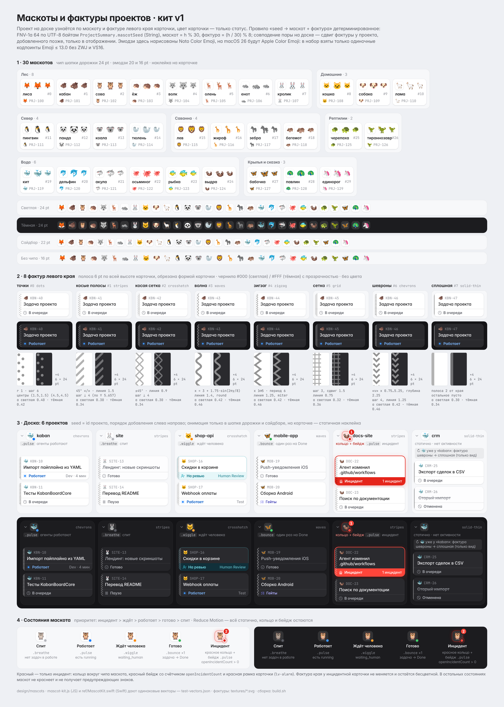

> Импорт из Drive 5 октября 2026. Полный текст дизайнера; пути в примерах относятся к `design/mascots/`.
> Версии и действующие правила — [индекс дизайна](README.md). Старые открытые вопросы не отменяют [журнал решений](../decisions-log.md).

# Маскоты и фактуры проектов: кит v1

Проект на доске узнаётся по двум признакам: **маскот** (эмодзи) и **фактура левого края карточки** (бесцветный узор). **Цвет карточки означает только статус.**

По арх. v0.11.6 §2 маскот рисует приложение (`KabanBoardCore`) по полю `ProjectSummary.mascotSeed`. Тип поля — `String`: `code/Sources/KabanProtocol/Entities.swift`, то же в `proto-v2/protocol-v2-code.patch`. Генератора маскотов в демоне нет. `setMascot(projectId, seed: String)` меняет только seed. В фикстурах seed по умолчанию равен id проекта (`"p-kaban"`).



## Что в папке

| Файл | Что это |
|---|---|
| `mascots-sheet.png` | превью @2x (2880×4030): все маскоты на чипах шапки дорожки и на наклейках карточек; 8 фактур на светлых и тёмных карточках; полоса доски из 6 проектов (светлая и тёмная); состояния маскота, включая инцидент |
| `mascots.html`, `mascots.css` | исходник листа; использует `../common.css`, `../board.css`, `../components.js` (`card()`, `mascotFace()`) |
| `mascot-kit.js` | эталон на JS (браузер и Node): список маскотов, параметры фактур, `fnv1a64`, `indices`, `pick`, `resolveBoard`, `seedFor`, `textureSVG` |
| `ref/MascotKit.swift` | эталон на Swift для `KabanBoardCore`: без `import`, macOS и Linux |
| `ref/main.swift` | проверка Swift-версии: печатает те же векторы |
| `ref/EdgeTextureView.swift` | набросок `Canvas` для `KabanUI` (SwiftUI). Здесь не компилировался: на сервере нет SwiftUI |
| `test-vectors.json` | 10 тест-векторов, пример коллизии и пример для MascotPicker; посчитаны запуском `node gen.js` |
| `textures/` | 32 SVG: для каждой фактуры `*-tile.svg` (один период, прозрачный фон) и `*-strip.svg` (полоса 6×96 на фоне карточки 24×96), в светлой и тёмной теме |
| `gen.js` | генерирует векторы и SVG фактур, проверяет FNV-1a на эталонных значениях, считает распределение |
| `build.sh` | `node gen.js`; затем `swiftc` и сравнение Swift с JS (если `swiftc` есть); затем рендер листа через `../tools/shot.js` @2x |

## 1. Набор маскотов: 30 штук

Порядок в списке **входит в спецификацию**: индекс = позиция. Переставлять, вставлять и удалять нельзя, это сдвинет маскоты у всех проектов. Если набор нужно поменять, это новая версия кита с явной миграцией seed.

| # | Эмодзи | Кодпоинт | Имя | Группа |
|---|---|---|---|---|
| 0 | 🦊 | U+1F98A | лиса (`fox`) | лес |
| 1 | 🐗 | U+1F417 | кабан (`boar`) | лес |
| 2 | 🦉 | U+1F989 | сова (`owl`) | лес |
| 3 | 🦔 | U+1F994 | ёж (`hedgehog`) | лес |
| 4 | 🐺 | U+1F43A | волк (`wolf`) | лес |
| 5 | 🦌 | U+1F98C | олень (`deer`) | лес |
| 6 | 🦝 | U+1F99D | енот (`raccoon`) | лес |
| 7 | 🐰 | U+1F430 | кролик (`rabbit`) | лес |
| 8 | 🐱 | U+1F431 | кошка (`cat`) | домашние |
| 9 | 🐶 | U+1F436 | собака (`dog`) | домашние |
| 10 | 🦙 | U+1F999 | лама (`llama`) | домашние |
| 11 | 🐧 | U+1F427 | пингвин (`penguin`) | север |
| 12 | 🐼 | U+1F43C | панда (`panda`) | север |
| 13 | 🐨 | U+1F428 | коала (`koala`) | север |
| 14 | 🦭 | U+1F9AD | тюлень (`seal`) | север |
| 15 | 🦁 | U+1F981 | лев (`lion`) | саванна |
| 16 | 🦒 | U+1F992 | жираф (`giraffe`) | саванна |
| 17 | 🦓 | U+1F993 | зебра (`zebra`) | саванна |
| 18 | 🦛 | U+1F99B | бегемот (`hippo`) | саванна |
| 19 | 🐳 | U+1F433 | кит (`whale`) | вода |
| 20 | 🐬 | U+1F42C | дельфин (`dolphin`) | вода |
| 21 | 🦈 | U+1F988 | акула (`shark`) | вода |
| 22 | 🐙 | U+1F419 | осьминог (`octopus`) | вода |
| 23 | 🐠 | U+1F420 | рыбка (`tropical-fish`) | вода |
| 24 | 🦦 | U+1F9A6 | выдра (`otter`) | вода |
| 25 | 🐢 | U+1F422 | черепаха (`turtle`) | рептилии |
| 26 | 🦖 | U+1F996 | тираннозавр (`t-rex`) | рептилии |
| 27 | 🦋 | U+1F98B | бабочка (`butterfly`) | крылья и сказка |
| 28 | 🦚 | U+1F99A | павлин (`peacock`) | крылья и сказка |
| 29 | 🦄 | U+1F984 | единорог (`unicorn`) | крылья и сказка |

**Почему такие:**
- **Только одиночные кодпоинты Emoji ≤ 13.0** с `Emoji_Presentation = Yes`: без ZWJ-склеек, без VS16 и без вариантов кожи. Это гарантирует одинаковую отрисовку Apple Color Emoji на macOS 26 и в любой версии системы.
- **Мордочки и компактные силуэты** (уши, рога, полосы, плавники) читаются в 16–20 pt.
- **Палитра разнесена** по семействам: рыжие 🦊🦁, бурые 🐗🦉🦔🦌🦦, серые и чёрно-белые 🐺🦝🐧🐼🐨🦭🦓🦛, синие 🐳🐬🦈🦋, зелёные 🐢🦖🦚, светлые 🐰🐱🐶🦙🦄, розово-фиолетовый 🐙, жёлтые 🦒🐠.
- **Группы:**
  - *лес* — «свои», тёплые; 🐗 — талисман бренда;
  - *домашние* и *север* — спокойные светлые и монохромные;
  - *саванна* — крупные узнаваемые узоры (грива, пятна, полосы);
  - *вода* — синий и бирюзовый диапазон, которого больше нигде нет;
  - *рептилии* и *крылья* — зелёный и сказочный акцент.

**Что сознательно не взято:**
- **Красные и розово-красные** (читаются как инцидент): 🦀🦞🦐🦑🐞🦂🦜🐓🦃🦩.
- **Похожие на предупреждение** (жёлто-чёрная «опасность», жёлтое пятно = «ждёт»): 🐝🐤🐥.
- **Обидные или с негативным смыслом в русском**: 🐷🐐🐑🐮🐄🐔🐍🐀🐁.
- **С политическим или национальным смыслом**: 🐻🦅🐘🫏🕊️🐉🐲.
- **С расистскими коннотациями**: 🐒🐵🦍🦧.
- **Со «смыслом» в разработке**:
  - 🐛🪲🦠 — баг;
  - 🐌🦥 — медленно;
  - 🦤 — вымирание;
  - 🐸 — мемные коннотации, к тому же зелёный, как «готово».
- **Пугающие**: 🕷️🦇🦟.
- **Склейки и VS16** (могут развалиться на два глифа): 🐈‍⬛🐻‍❄️🐦‍⬛🐿️.
- **Слишком похожие на уже взятые**: 🐯 (к 🦁🦊), 🦕 (к 🦖), 🐹 (к 🐱), 🐋 (к 🐳).

## 2. Фактуры левого края: 8 штук

**Геометрия полосы:**
- Ширина **6 pt** у левого края карточки, по всей высоте.
- Полоса обрезается формой карточки, то есть повторяет скругление углов.
- Под полосой — фон карточки; узора под текстом нет: `card-body` начинается с 12 pt.

**Цвет:**
- Чернила — **#000000** в светлой теме и **#FFFFFF** в тёмной; прозрачность α указана в таблице.
- Это чистый серый без оттенка, поэтому цвет карточки остаётся только у статуса.
- Фактура никогда не окрашивается в цвет статуса, в том числе у инцидентной карточки.

Единицы — pt. Начало координат — левый верхний угол карточки. Концы линий `butt`.

| # | key | Рисунок и параметры | α светлая | α тёмная |
|---|---|---|---|---|
| 0 | `dots` | точки r 1.0, период 6 по Y, центры (1.5, 1.5) и (4.5, 4.5) — шахматно | 0.40 | 0.42 |
| 1 | `stripes` | линии «/» под 45°, толщина 1.5, шаг 4 перпендикулярно (по Y 4·√2 = 5.657); линия от (0, c+6) до (6, c) | 0.30 | 0.34 |
| 2 | `crosshatch` | «/» и «\» под ±45°, толщина 0.9, шаг 4 ⟂ | 0.30 | 0.34 |
| 3 | `waves` | x = 3 + 1.75·sin(2πy / 8), толщина 1.4, join round (дискретизация 0.5 pt) | 0.42 | 0.46 |
| 4 | `zigzag` | ломаная x 1 ↔ 5, вершина каждые 3 по Y (период 6), толщина 1.25, join miter | 0.42 | 0.46 |
| 5 | `grid` | вертикали x = 1.5 и 4.5, горизонтали y = 1.5 + 3k, толщина 0.75 | 0.32 | 0.36 |
| 6 | `chevrons` | «v» вниз: (0.75, y) → (3, y+2.25) → (5.25, y), шаг 4, толщина 1.25, join miter | 0.42 | 0.46 |
| 7 | `solid-thin` | сплошная полоса 2 pt от края, остальные 4 pt пустые | 0.30 | 0.34 |

- Все формулы есть в `textureSVG()` в `mascot-kit.js` и в наброске `ref/EdgeTextureView.swift`. SVG-тайлы в `textures/` сгенерированы из этих же параметров.
- Для **Increase Contrast** предлагаю умножить α на 1.3 и ограничить сверху 0.6; фактура остаётся бесцветной.
- Фактура декоративная: `accessibilityHidden`. Проект в VoiceOver называется по имени.

## 3. Правило seed → (маскот, фактура)

```
h            = FNV-1a 64 (UTF-8 байты mascotSeed)     // offset 0xcbf29ce484222325, prime 0x100000001b3, по модулю 2^64
mascotIndex  = h % 30                                  // N = 30 маскотов
textureIndex = (h / 30) % 8                            // целочисленное деление UInt64
```

- **Seed — всегда строка.** Байты берутся как есть: без нормализации Unicode, trim и смены регистра. В Swift это `seed.utf8`, в JS — `TextEncoder`, в JS нужен `BigInt`. Целочисленный seed в протоколе не встречается, поэтому ветки «число как есть» нет. Строку из одних цифр тоже хэшируем как строку.
- **N = 30 выбрано не степенью двойки.** У FNV-1a младшие 8 бит зависят только от младших бит входа и плохо перемешаны. `h % 30` зависит от всех 64 бит; маскирование `h & 31` использовать нельзя.
- **Распределение проверено** на 240 000 синтетических seed: χ² = 32.3 по маскотам (29 степеней свободы), 1.7 по фактурам (7), 237 по парам (239). Это равномерно.
- **Эталон FNV:** `""` → `0xcbf29ce484222325`, `"a"` → `0xaf63dc4c8601ec8c`, `"foobar"` → `0x85944171f73967e8`. Это проверяется в `gen.js`.

### Совпадения на доске (только отображение)

- Если у двух проектов на доске совпала пара (маскот, фактура), то у **проекта, добавленного на доску позже**, фактура сдвигается на +1, +2, … по модулю 8, пока пара не станет свободной.
- **Маскот не меняется никогда:** это личность проекта.
- Результат **не сохраняется**: ни в демоне, ни в `setMascot`.
- **Порядок обхода** — порядок добавления на доску: `BoardSetStore` хранит, когда проект был добавлен, а не текущий порядок дорожек. Поэтому перетаскивание дорожек фактуры не меняет. Если более ранний проект убрали с доски, сдвиг у позднего исчезает, и это нормально.
- Если все 8 фактур у этого маскота заняты (9+ проектов с одним маскотом), остаётся базовая фактура.
- Функции: `MascotKit.resolveBoard(_:)` и `resolveBoard()` в JS.
- **Пример** (порядок добавления p-kaban, p-site, shop-api, mobile-app, docs-site, p-crm-4): у `p-crm-4` базовая пара 🐳 + chevrons совпала с `p-kaban`, поэтому на доске он рисуется как 🐳 + **solid-thin**. Пример есть на листе, в разделе 3.
- Совпадение только маскота (при разных фактурах) допустимо. MascotPicker может подсказать: «такой маскот уже у проекта X».

### MascotPicker → setMascot

- Пользователь выбирает маскот и фактуру.
- Клиент ищет seed `"<projectId>#k"` с наименьшим k ≥ 1, который даёт эту пару (в среднем около 240 попыток), и отправляет `setMascot(projectId, seed)`.
- Функции: `MascotKit.seed(for:mascotIndex:texture:)` и `seedFor()` в JS.
- **Пример:** чтобы у `p-kaban` был 🐗 + stripes, нужен seed `p-kaban#89`. Без этого `p-kaban` по правилу получает 🐳 + chevrons.

### Тест-векторы

Посчитаны запуском JS (`node gen.js`, `test-vectors.json`). `ref/main.swift` выдаёт ровно то же: `build.sh` печатает «Swift == JS».

| # | seed | FNV-1a 64 | mascotIndex | textureIndex | маскот | фактура |
|---|---|---|---|---|---|---|
| 1 | `"p-kaban"` | `0xd8220f758d092a87` | 19 | 6 | 🐳 whale | chevrons |
| 2 | `"p-site"` | `0xcb1f979490ec3795` | 7 | 1 | 🐰 rabbit | stripes |
| 3 | `"shop-api"` | `0x28452d2ae9ddfa44` | 8 | 2 | 🐱 cat | crosshatch |
| 4 | `"mobile-app"` | `0xd09b6e8799a2b6c5` | 27 | 3 | 🦋 butterfly | waves |
| 5 | `"docs-site"` | `0xa79f85873f359226` | 24 | 1 | 🦦 otter | stripes |
| 6 | `"infra"` | `0x75503f8f8917ecdd` | 15 | 1 | 🦁 lion | stripes |
| 7 | `""` | `0xcbf29ce484222325` | 17 | 6 | 🦓 zebra | chevrons |
| 8 | `"8a60b3cc-6141-80fc-8008-bbcd3bd40972"` | `0x57eaf543ddc8dc80` | 22 | 3 | 🐙 octopus | waves |
| 9 | `"проект-кабан"` | `0xdff835beda121bca` | 24 | 7 | 🦦 otter | solid-thin |
| 10 | `"p-kaban#1"` | `0x16fe18f50c8f26c7` | 7 | 0 | 🐰 rabbit | dots |

Дополнительно:
- `resolveBoard` из примера выше → `p-crm-4`: mascot 19, texture 7 (bumped);
- `seedFor("p-kaban", 1, 1)` → `"p-kaban#89"`.

## 4. Анимации и где они живут

- **Анимированный маскот — только в сайдбаре и в шапке дорожки.** На карточке — статичная наклейка (`.sticker`), без анимации и без точки состояния.
- **Состояния и приоритет:** тревога > ждёт > работает > готово > спит.
  - спит — `.breathe`: в работе нет задач, эмодзи слегка обесцвечен;
  - работает — `.pulse`: есть `running`;
  - ждёт человека — `.wiggle`: `waiting_human`;
  - готово — `.bounce` **один раз**, когда задача переходит в Done, потом обратно в текущее состояние;
  - инцидент — см. ниже.
- **Когда играет анимация:** только по событию (FS-5), эмодзи анимируются через `keyframeAnimator`. В простое на доске ничего не крутится.
- **Reduce Motion:** всё статично. Состояние передают точка у чипа и (для инцидента) кольцо и бейдж.

## 5. Как выглядит инцидент

- **Красный разрешён только здесь.** Инцидент — это `openIncidentCount > 0` у проекта или карточка `waiting_human · incident`.
- **Чип маскота** получает красное кольцо (1 pt `--st-incident` с мягким красным свечением) и красную подложку. Это уже есть в `common.css` как `.m-alarm`.
- **Справа сверху у чипа** — красный бейдж со счётчиком `openIncidentCount` (`.badge-n.r`). В сайдбаре и шапке дорожки бейдж пульсирует (`.pulse`); при Reduce Motion — статичный.
- **Карточка инцидента:** красная рамка и красная статус-строка (`lv-alarm`). Наклейка маскота на ней статичная. **Фактура края остаётся бесцветной.**
- **Во всех остальных состояниях** у маскота нет красного, нет предупреждающих и галочных знаков. Цветная точка состояния берёт токены статусов: синий — работает, янтарный — ждёт, зелёный — готово, серый — спит.

## 6. Расхождения с документами

1. **UC-16.1–2 против протокола.**
   - UC-16 говорит: «маскот — SF Symbol или эмодзи», «можно сменить на любой эмодзи или SF Symbol».
   - В протоколе `setMascot(projectId, seed: String)` меняет только seed, поэтому по правилу кита доступны только 30 маскотов набора.
   - Если нужен произвольный эмодзи или SF Symbol, это отдельный формат seed (например, префикс `emoji:`/`symbol:`). Это решение аналитика и архитектора; в кит v1 не вошло.
2. **«SVG маскотов» в плане фронта (раздел 10)** против этого брифа (эмодзи). Сделано на эмодзи; SVG только у фактур.
3. **Арх. §11 против §2.**
   - §11: «Маскот — личная настройка в БД, генерируется из стабильного id проекта».
   - §2 (v0.11.6): генератора нет, приложение рисует по `mascotSeed`.
   - Читаю так: в БД хранится seed (по умолчанию id проекта, как в фикстурах), а «генерация» — это правило этого кита в `KabanBoardCore`. Стоит переформулировать §11.
4. **Макеты v0.1/v0.2/v0.2.1 нарисованы условно** и не соответствуют правилу.
   - Там маскоты 🦊 shop-api, 🐗 kaban, 🐙 mobile-app, 🦉 docs-site, 🐢 infra и фактуры `solid`/`stripes`/`dots`/`checks` шириной 3–4 px.
   - По правилу `p-kaban` → 🐳 + chevrons (🐗 — через MascotPicker, seed `p-kaban#89`).
   - Фактуры `checks` (горизонтальные штрихи) в новом наборе нет; полоса теперь 6 pt.
   - Старые PNG и макеты не трогал.
5. **Бриф: `mascotIndex = h % N`.** Формула оставлена, но N = 30 (не степень двойки): см. раздел 3.

## Как пересобрать

```bash
cd design/mascots && ./build.sh      # векторы + SVG фактур + проверка Swift==JS + mascots-sheet.png (1440×2015 @2x)
```

Эмодзи на листе нарисованы Noto Color Emoji: на сервере нет Apple Color Emoji. На macOS 26 глифы будут Apple, а набор кодпоинтов тот же.
