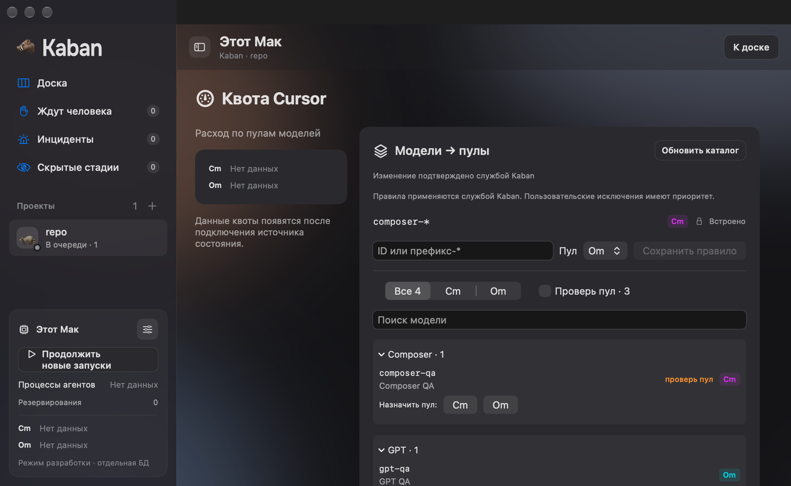
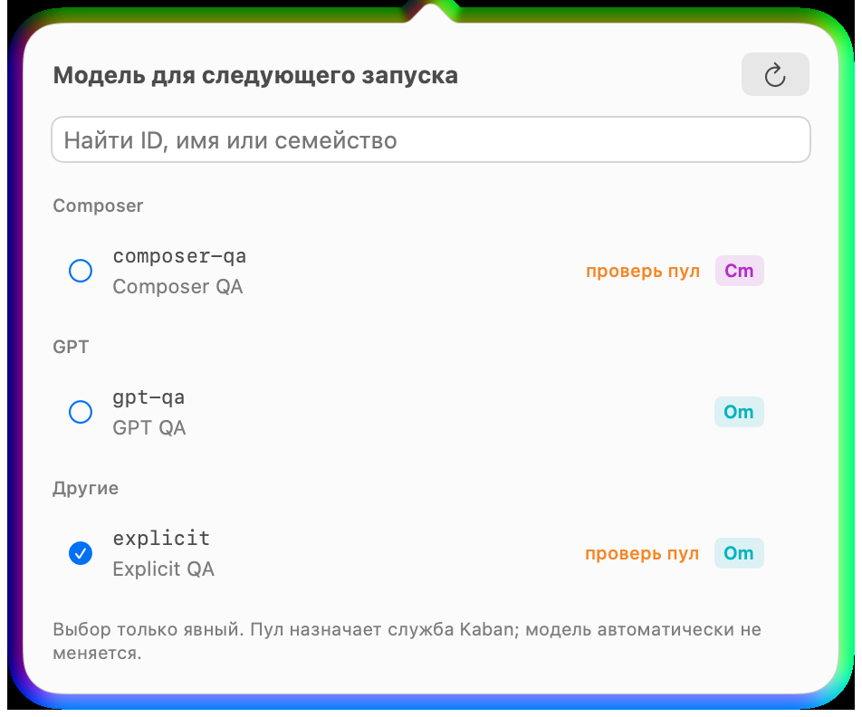
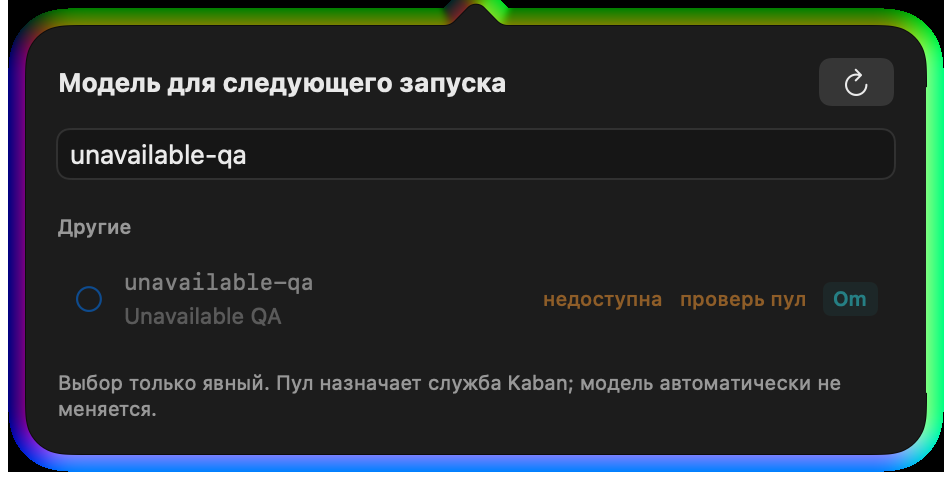
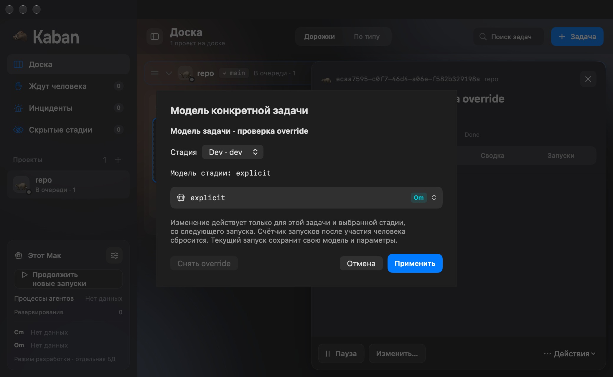
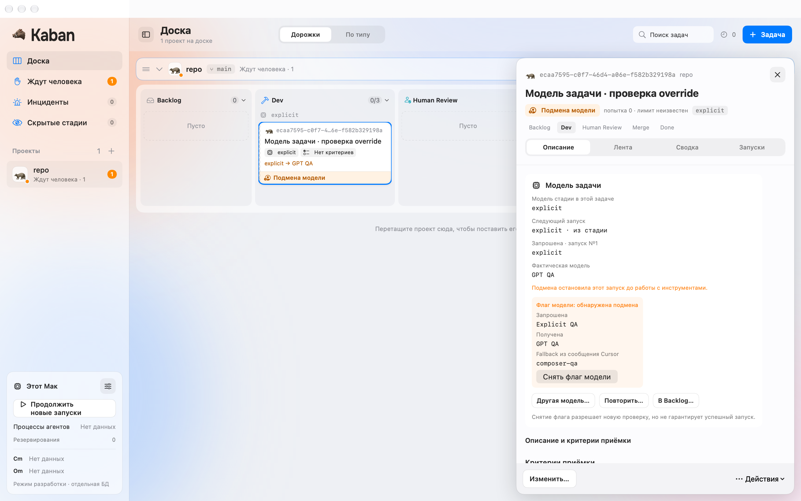
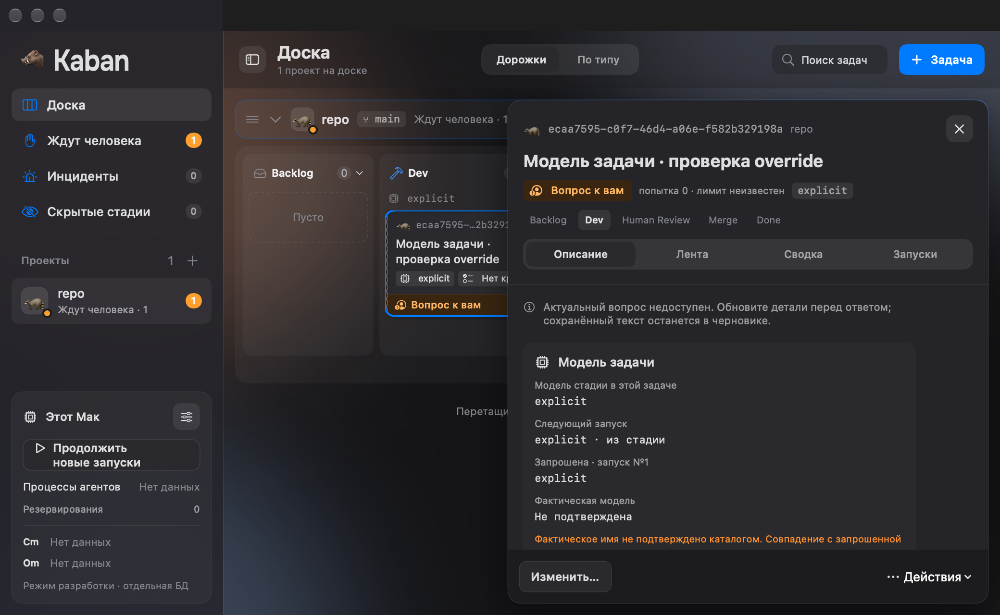

# FE-14: каталог моделей, пулы и override задачи

8 октября 2026. Код `8913aeb`, ветка `codex/fe-14-model-catalog`, отдельный
managed worktree. База — FE-13 `37f9feb` из [PR #104](https://github.com/imedfan/kaban/pull/104);
после fetch main остаётся `6aac109`. FE-13 нужна для общего pipeline draft и ещё
не принята в main. Все шесть CI jobs её финального SHA прошли.

## Реализация

Общий SwiftUI ModelPicker используется в форме agent-стадии и task override.
Показывает ID/имя, семейство для группировки, серверный Cm/Om, needsReview,
недоступность и флаг подмены. Auto/forbidden скрыты, missing/unavailable нельзя
выбрать. Первая модель сама не выбирается; неизвестный текущий ID остаётся виден.
Группировка по ID влияет только на представление; клиент не вычисляет пул.
В pipeline picker меняет адресованное поле прежнего точного YAML draft FE-13.
Required model и Auto окончательно проверяет backend.

На экране квоты каталог расположен справа от существующих данных квоты, как в
`design/v0.2/png/06-mac-quota-menubar.png`. Правила, исключения, фильтр «Проверь пул»,
поиск, семейства и refresh используют production commands. Сохранённые правила
читаются в Snapshot из scheduler inputs; копии в UserDefaults нет. Pool rule,
refresh и clear flag публикуют correlated settingsChanged с полными model facts.
Нераспознаваемый ответ Cursor CLI теперь возвращает отказ и сохраняет каталог.
Завершённый refresh имеет собственное событие, а replay не повторяет CLI probe.

TaskDetail передаёт agent-стадии frozen pipeline задачи и сохранённые override.
Отдельная форма отправляет setModelOverride только для выбранных task/stage;
снятие возвращает frozen stage model. UI объясняет следующий запуск и сброс
human counter. Смена модели не меняет текущий run, его requested/actual, attempts
и frozen pipeline. Устаревшую задачу/сессию нужно сверить, выбор при этом остаётся.

Блок модели различает requested, actual и fallback глобального флага; nil actual
показывается как «Не подтверждена». При подмене он показан первым.
«Другая модель» открывает override; retry и Backlog используют существующие
FE-07 typed controls и их подтверждение. clearModelFlag не обещает успех запуска.

Snapshot/projection остаются владельцами подтверждённых фактов. ModelSettingsStore
держит только read/error/command state. Retained volatile flags/catalog не могут
переписать новый snapshot; transport и BoardSession отбрасывают более старый
afterSeq после модельной команды. Новые DTO поля optional, legacy unknown отличим
от подтверждённого пустого набора. Старые required fields не ослаблены.

## Приёмка

| Критерий | Проверка | Результат |
|---|---|---|
| Явная модель, запрет unavailable | PipelineEditorTests/backend validation, ModelSettingsTests, настоящий disabled picker row | Прошла; текущий unknown ID сохранён |
| Task/stage override и backend pools | ModelCatalogStoreTests: другая task, reopen, снятие, текущий run/counters; native commands flow | Прошла; project YAML не изменён |
| Подмена/unknown actual и действия | Backend model observation tests; native decision DTO в private DB; typed TaskControlTests и native override/clear | Прошла; actual не выдумана, fallback подписан источником |
| Refresh failure/reconnect сохраняют ввод | Native failed refresh с изменённым pipeline draft; late read и retained/seq regressions | Прошла; данные не заменены демокаталогом |

Проверки кода: `KABAN_SCENARIOS=Scenarios/M1 swift test` — 644 tests, 0 failures
(29 Transport, 68 Protocol, 180 Kit, 185 DaemonCore, 182 BoardCore).
Linux Docker `swift:6.1` с libsqlite3-dev/python3 — 78 tests по Transport,
ModelSettings/ModelCatalogStore, BoardSession, PipelineEditor и legacy compatibility.
Unsigned App xcodebuild прошла; context checker и diff check прошли.

`python3 tools/check-model-settings.py` запустил 11 настоящих WindowGroup:
empty, commands flow, settings light/dark minimum, picker, disabled unavailable
picker, unknown long ID, override sheet/Escape, substitution, unconfirmed actual
и refresh error. Снимки: 1440×900 и минимум 1040×640 в светлой/тёмной теме.
Полные результаты — [checks.json](screenshots/fe-14/checks.json), размеры и hashes —
[frames.json](screenshots/fe-14/frames.json).

## Окна

## Границы

Команды проверены через настоящий private daemon и developer stdio, с отдельным
Git repository/SQLite. CLI fixture поддерживает только version/status/list-models;
Мак поставлен на паузу перед его настройкой. Каталог не fixture основного UI:
это ответ тестового CLI через production refresh. Native states подмены/unknown
actual подготовлены как DTO в private DB; они не доказывают живой system/init.
Поведение production observation отдельно покрыто backend tests.

Настоящий авторизованный Cursor, paid runs, signed installed helper/XPC, ручной
pointer и VoiceOver не проверены. Escape реально закрывает override sheet;
popover и недоступный row проверены в нативном окне, pointer selection не заявлена.
AppKit capture popover содержит системный material/glow; это не HTML/галерея.
Полная квота/menubar — FE-20/21, policy/workspace — FE-15, MCP — FE-16,
общая installed/system приёмка — FE-22. Полный M1/MVP не закрыт.

## Интеграция main после PR #104

8 октября main обновлён до `83f223b`. Его дерево точно совпало с FE-13 `37f9feb`.
Конфликты App/QA, pipeline view, Xcode project и current-state разрешены с
сохранением model picker и дополнений FE-14. Production-код относительно
`3b25121` не изменился. Native ModelQA теперь ждёт окончания reconciliation
перед следующей командой; отказ отправки не принимается за прошлый receipt.
До исправления сценарий завершался ошибкой `Rule removal not confirmed`.

После разрешения прошли 270 tests из BoardCore, Protocol, model suites и
PipelineLifecycleTests, unsigned App build, context checker и diff check.
Повторный `tools/check-model-settings.py` прошёл все 11 сценариев.
Новые private доказательства сохранены в `/tmp/kaban-fe14-iu9f_98w`;
исходные кадры и source SHA выше не заменены этим повторным прогоном.
