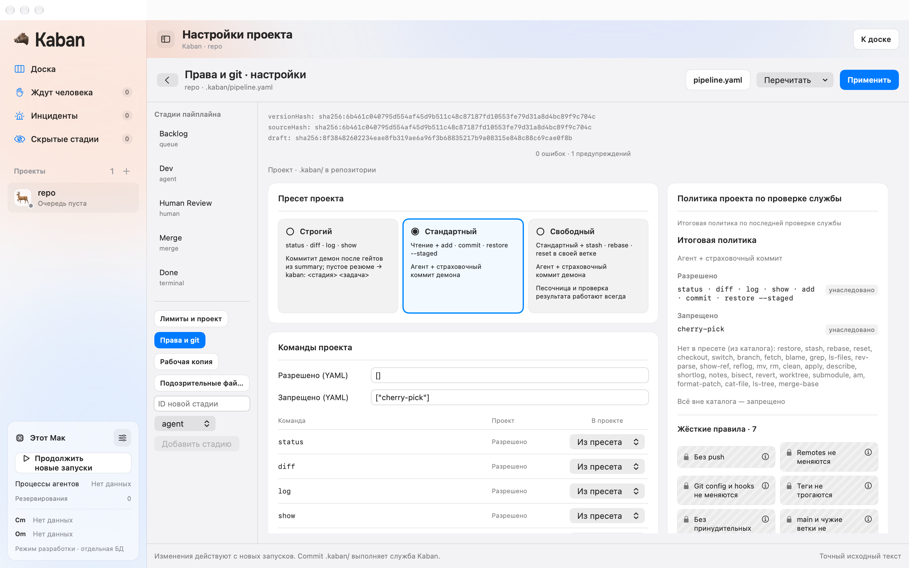
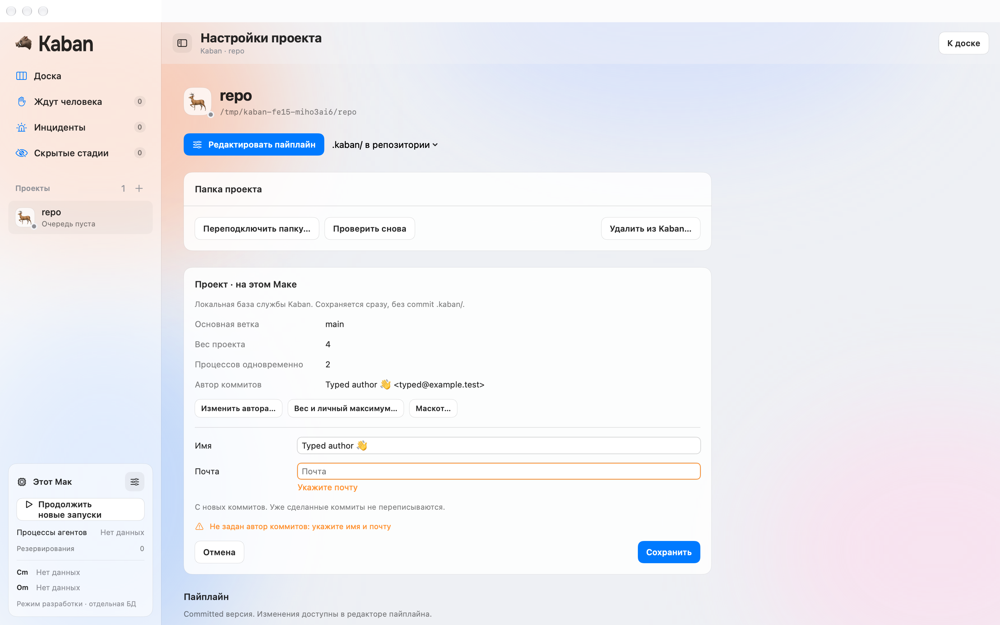
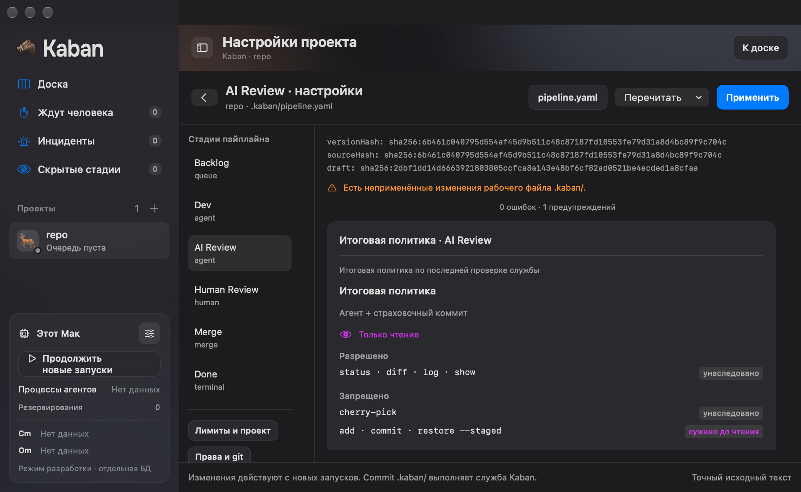
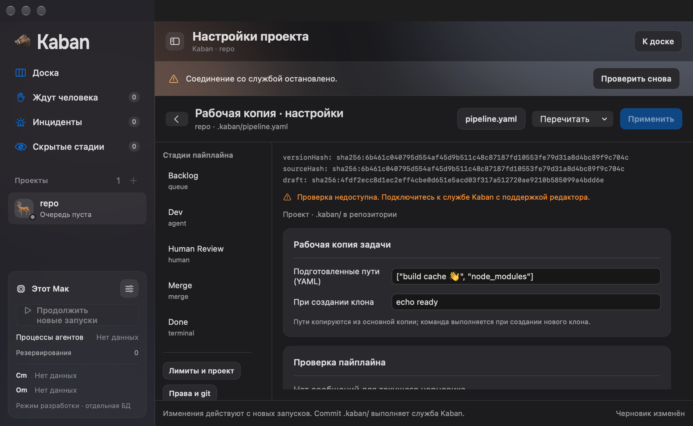

# FE-15: настройки проекта, git и workspace

8 октября 2026. Проверенный код `f7c37912f39d8e6f0a2fc47e692369e54168f3aa`,
ветка `codex/fe-15-project-settings`. После fetch `origin/main` остаётся `6aac109`.
Ветка включает зависимости FE-13 из [PR #104](https://github.com/imedfan/kaban/pull/104)
и FE-14 из [PR #105](https://github.com/imedfan/kaban/pull/105). Оба PR пока открыты;
все шесть CI jobs каждого прошли на `37f9feb` и `3b25121` соответственно.

## Сохраняемые значения и черновики

В настройках проекта доступны автор, вес, личный максимум и существующий выбор
маскота. `ProjectSettingsStore` держит ввод отдельно от `ProjectSummary`.
`setProjectIdentity`, `setProjectWeight` и `setMascot` сохраняют metadata в базе
демона; projection меняется по correlated `projectUpdated`. Ответ `.ok` не закрывает
форму. Отказ сохраняет ввод, включая адресованные ошибки `missing` и `invalid`.
Повторный callback поля с тем же значением не снимает подсветку отказа.
Черновики автора и ресурсов переживают переключение раздела в текущем BoardStore.
Отмена явно сбрасывает черновик выбранного раздела.

Git, workspace и suspicious files используют единственный `PipelineEditorStore`
проекта. Пресет, project allow/deny, stage extend/deny/when, `warm_paths`, `on_create`,
patterns, max_file_mb и allow меняют точный исходный текст. Обычные block lists
редактируются без перезаписи соседних ключей; inline comments сохраняются.
Сложные YAML-конструкции остаются в исходном редакторе. Проверку и применение
выполняет backend через контракты FE-13. Настройки действуют с новых runs.

`GitPolicyView` отображает `EffectiveGitPolicy` и каталог демона. Условия, committer,
readOnly, источник правил и порядок `hardInvariants` берутся из resolved DTO.
Клиент не сопоставляет префиксы git-правил. Неизвестные sources не получают метку,
неизвестный invariant отображается исходным ID. У плиток жёстких правил нет
переключателя; известные правила имеют справочный поповер. Своего preset стадии нет.

Native меню направляет ⌘↩ в открытый редактор pipeline либо активную metadata форму.
Форма прокручивается в видимую область при начале редактирования. Переход к pipeline
работает и из уже открытого экрана проекта.

## Критерии приёмки

| Критерий | Проверка | Результат |
|---|---|---|
| Metadata меняется по projectUpdated и сохраняется после restart | BoardCore проверяет `.ok`, чужое событие и correlated event; native private daemon сохраняет автора, weight=4, maxRuns=2 и mascot, затем App запускается повторно | Прошёл |
| Preview соответствует backend; инварианты заблокированы | Native apply сравнивает draft resolved с applied snapshot; проверяется полный `HardInvariant.all`. Unit проверяет неизвестные source/ID и точное отображение каталога. Кадры показывают read-only сужение | Прошёл |
| Workspace/files/policy сохраняются общим validated draft без потери чужих полей | Production updatePipeline подтверждает exact committed text с `future_extension` и комментариями; отдельная проверка CRLF, Unicode и block lists | Прошёл |
| Ошибки сохраняют authoritative значение и ввод | Настоящие identity/resource отказы, max_file_mb=0 и остановка client session; unit проверяет повтор binding и отключение | Прошёл |

## Проверки кода и окна

Полный `KABAN_SCENARIOS=Scenarios/M1 swift test` прошёл: Transport 29,
Protocol 68, Kit 180, DaemonCore 185, BoardCore 186. Всего 648 тестов без ошибок.
После последних изменений поля автора повторно прошли все 186 BoardCore tests.
На Linux Swift 6.1 прошли 43 tests из ProjectSettingsTests, PipelineEditorTests,
IdentityDraftTests, ProjectLifecycleStoreTests и BoardSessionTests.
Unsigned `xcodebuild` для Kaban.app прошёл. Context checker и diff check прошли.

`python3 tools/check-project-settings.py` проверил 17 запусков настоящего WindowGroup
с production daemon через private stdio и отдельной SQLite базой. Mac поставлен на
паузу до работы с конфигурацией. Сценарий вводит вес в настоящий `NSTextField` и
сохраняет его через native меню ⌘↩. Workspace hook и Cursor runs не запускаются.
Последняя fixture находится в `/tmp/kaban-fe15-miho3ai6`.

[Проверки сценариев](screenshots/fe-15/checks.json) и
[manifest кадров](screenshots/fe-15/frames.json) содержат source SHA и хэши PNG.
Проверены metadata, отказ автора, ресурсы, длинный ввод, project/stage git,
workspace, files, отсутствующий YAML, invalid size и disconnected draft.
Проверены light/dark и размеры 1440×900 и 1040×640.

## Границы проверки

Это developer transport с настоящим store и production lifecycle проекта.
Installed helper, signed folder grants, pointer, VoiceOver, наведение на popover и
авторизованный Cursor не проверены. Неизвестные policy IDs и sources проверены
unit tests; backend этой версии не производит их для native кадра. Проверено
сохранение конфигурации workspace и files, а не выполнение on_create или создание
нового рабочего клона. Эти ограничения относятся к системной приёмке FE-22.
Независимое ревью не выполнялось; проведён собственный разбор diff и порядков событий.
MCP настройки и выбор серверов стадии остаются FE-16. Полный MVP не принят.

## Интеграция main после PR #104

8 октября main обновлён до `83f223b`, FE-13 принята. В FE-15 перенесено
разрешение FE-14 `d55fc09`: принятый pipeline editor, model picker и settings
сохранены. Единственный конфликт этого переноса был в current-state;
таблица сохраняет поверхность FE-15 и статус FE-13 в main. Production-код
относительно `73d6c57` не изменился; исправление ожидания native ModelQA пришло
из FE-14. Все шесть CI jobs исходного FE-15 `73d6c57` прошли до этого переноса.

После разрешения прошли 274 tests из BoardCore, Protocol, model suites и
PipelineLifecycleTests, unsigned App build, context checker и diff check.
Повторный `tools/check-project-settings.py` прошёл все 17 сценариев.
Новые private доказательства находятся в `/tmp/kaban-fe15-zkjzxq27`;
исходные source SHA и кадры выше относятся к первоначальной реализации.

## Интеграция main после PR #105

8 октября FE-14 принята в main как `cda9b4f`. Его дерево полностью совпадает
с `d55fc09`, уже присутствующим в FE-15. Конфликты squash-истории разрешены
в BoardQA, BoardView, KabanApp, Xcode project и current-state. Сохранены
маршруты settings QA, секции общего pipeline editor и файлы FE-15 в App target.
Production-код относительно `74598c0` не изменился. Current-state отражает
FE-14 в main и FE-15 в своей ветке.

Повторная native проверка до исправления QA остановилась на
`Timed out waiting for authoritative mascot`. В private БД
`/tmp/kaban-fe15-g5df00uq/store.sqlite` сохранены identity и weight команды,
но нет setMascot. QA начинал следующую отправку после correlated projectUpdated,
пока BoardSession ещё выполнял reconciliation и блокировал новые команды.
ProjectSettingsQA теперь ждёт также canSend после создания проекта, автора
и веса. Для маскота проверяются отправка и correlated event, затем authoritative
значение. Утверждения о сохранении настроек не ослаблены.

После разрешения конфликтов прошли 274 tests из BoardCore, Protocol, model
suites и PipelineLifecycleTests. После правки QA повторный unsigned App build
и все 17 сценариев `tools/check-project-settings.py` прошли. Проверены реальные
light и dark/minimum окна; context checker, отсутствие conflict markers и
diff check прошли. Новые private доказательства находятся в
`/tmp/kaban-fe15-67ynw3pn`, логи в `/tmp/kaban-pr106-tests.log`,
`/tmp/kaban-pr106-app.log` и `/tmp/kaban-pr106-native-fixed.log`.
