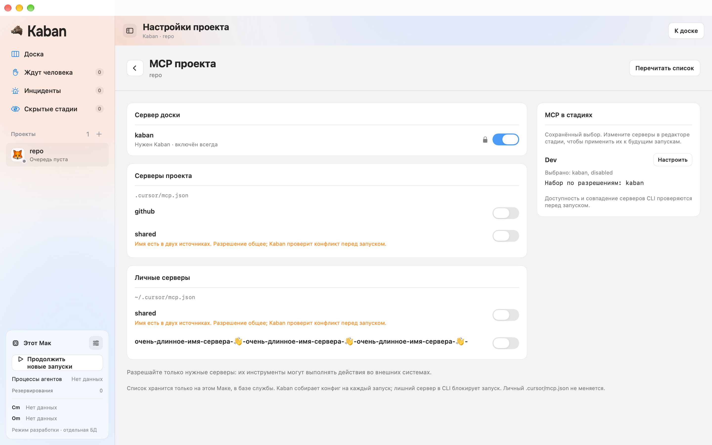
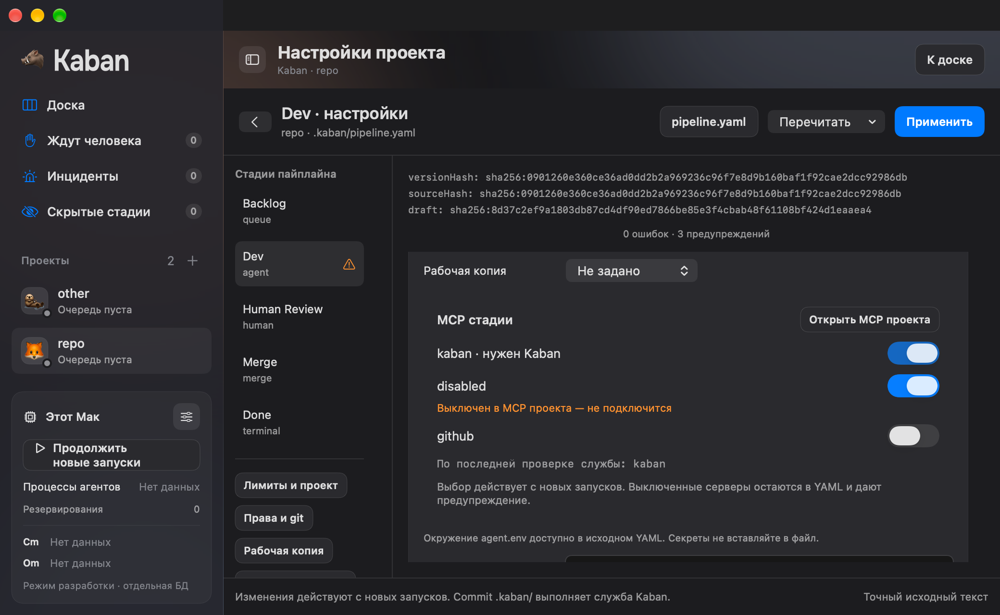
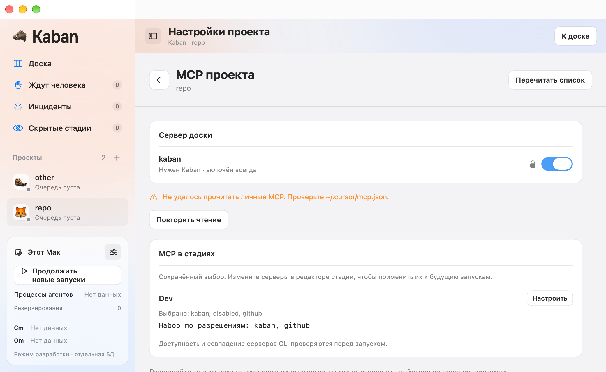
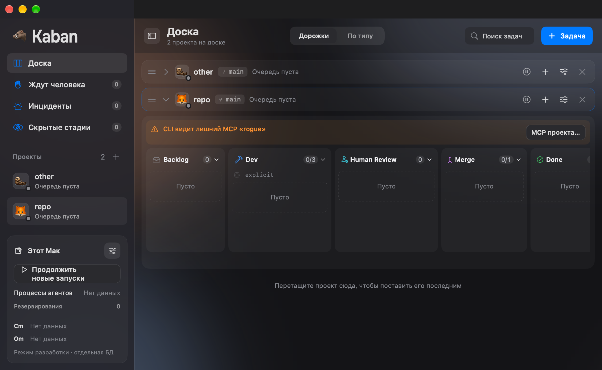

# FE-16: MCP проекта и выбор серверов стадии

8 октября 2026. Проверенный код `8a06d992ac859dc710cb35ba7f0a692d98e50f59`,
ветка `codex/fe-16-project-mcp`. FE-13 принята в main `83f223b` через
[PR #104](https://github.com/imedfan/kaban/pull/104). Ветка включает FE-14 из
[#105](https://github.com/imedfan/kaban/pull/105) и FE-15 из
[#106](https://github.com/imedfan/kaban/pull/106), включая разрешения их конфликтов
`d55fc09` и `74598c0`. Оба PR остаются открыты; их новый CI выполняется.

## Разрешения и authoritative состояние

Нативный экран следует `design/v0.2/png/05-project-mcp.png`. Демон читает
проектный и личный `.cursor/mcp.json`; App получает только имена и source.
URL, команды, аргументы, headers и credentials не попадают в DTO. Отсутствующий
файл означает пустой источник. Повреждённый, недоступный или symlink-конфиг
возвращает явный `mcp_config_unreadable` с безопасным указанием источника.

`setProjectMcpAllowlist` сохраняет разрешения по имени в существующей
`project_mcp_allow`. DB, journal и wire receipt записываются атомарно;
повтор commandId воспроизводит исходный результат. `.ok` не меняет switches:
они отражают correlated `projectUpdated`. `kaban` обязателен и заблокирован.
Одно имя из двух источников показано двумя строками с общим разрешением и
объяснением конфликта. Отсутствующие сохранённые имена удаляются только явно.
Конфигурационные файлы и разрешения других проектов не меняются.

Новые optional facts `ProjectSummary.mcpAllowlist/mcpIssue` и
`StageSummary.mcp/effectiveMcp` совместимы с legacy snapshots. Отсутствующие
разрешения отображаются как неизвестные. Эффективные имена считает backend
тем же фильтром, который использует MCP preflight.

## Выбор стадии и unexpected

Stage picker меняет точный YAML через существующий `PipelineEditorStore`.
Добавляются только разрешённые серверы; ранее выбранный выключенный сервер
остаётся в YAML и даёт warning. Валидный draft можно применить. Комментарии,
CRLF, Unicode и неизвестные соседние поля сохраняются. Изменение разрешений
требует новой серверной проверки перед apply. Переход в MCP проекта и native
Escape возвращают тот же draft, стадию и раздел.

Сохранённый unexpected server виден на доске и в MCP settings. Recheck проекта
перепроверяет папку и pipeline, но сохраняет MCP-блок. Его снимает только свежий
успешный `applyMCPPreflight`. Миграция v21 хранит вид диагностики, чтобы unexpected
и unresolvable различались после restart. UI не предлагает разрешить всё.

**Полный третий критерий FE-16 остаётся открытым.** Живой `cursor-agent mcp list`
не подключён к production `recheck(project)`; исправление конфигов и кнопка
recheck пока не доказывают устранение unexpected через настоящий CLI.
Backend seam проверен unit tests. Два native unexpected сценария используют
явно подготовленный preflight fact в private DB и проверяют его отображение
и сохранение после настоящего recheck, без запуска CLI.

## Проверки

Полный `KABAN_SCENARIOS=Scenarios/M1 swift test` прошёл. Transport 29,
Protocol 69, Kit 180, DaemonCore 187, BoardCore 188; всего 653 tests без ошибок.
После интеграции разрешений #105/#106 файлы Sources/Tests не изменились.
Unsigned App build финального `8a06d99`, context checker и diff check прошли.
На Linux Swift 6.1.3 arm64 прошли 308 tests без ошибок. Один ожидаемый skip
приходится на macOS Seatbelt (`sandbox-exec` отсутствует на Linux); полный
macOS прогон проверяет его. Контейнеру установлены обязательные SQLite headers,
daemon для subprocess tests взят из Linux build, а не из macOS checkout.

Regression проверки сначала воспроизвели две ошибки. `confirmApplied` во время
reconciliation показывал «Чтение исходного YAML недоступно у подключённой службы».
Позднее транспортное исключение заменяло состояние каталога старой сессии на
`failed("Old connection failed")`. Исправления прошли полный прогон. Первое
ожидание native apply также сохранено до окончания reconciliation и точного
чтения committed YAML; assertions на исходные байты не ослаблены.

`python3 tools/check-project-mcp.py` прошёл 11 запусков настоящего WindowGroup с
production daemon через private stdio. Проверены native switches, correlated
permissions, restart, второй проект, warning-only apply, точный committed source,
Escape, disconnected draft, read failure, source collisions и unexpected.
Проверены light/dark, 1440×900 и 1040×640, длинное Unicode-имя.
Private fixture находится в `/tmp/kaban-fe16-lt_tcph5`.

[Проверки сценариев](screenshots/fe-16/checks.json) и
[manifest кадров](screenshots/fe-16/frames.json) содержат source SHA и PNG hashes.

## Границы

Mac поставлен на паузу; agent runs и workspace hooks не запускались. Личный
конфиг подменяется только явно переданным private QA path; production default
остаётся `~/.cursor/mcp.json`. Installed helper/XPC, signed folder grants,
авторизованный Cursor, физический pointer и VoiceOver не проверены. Native
control actions и Escape проверены через AppKit; это не системная ручная приёмка.
Независимое ревью не выполнялось; проведён собственный разбор diff и lifecycle.
Полный M1/MVP не принят. Пользователь поручил остановить работу после публикации
PR; FE-17 в этом инкременте не начинается.
