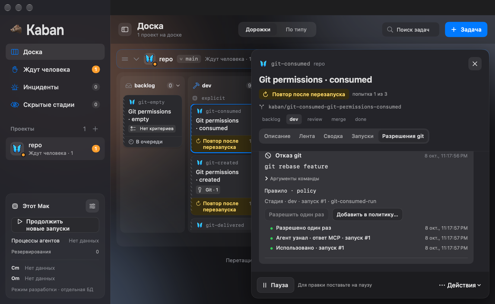
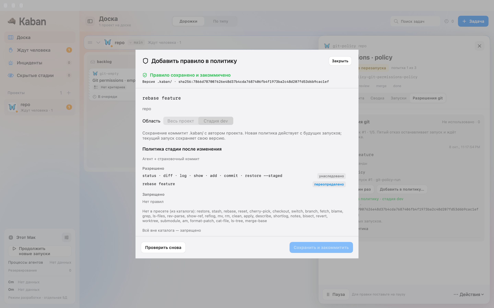
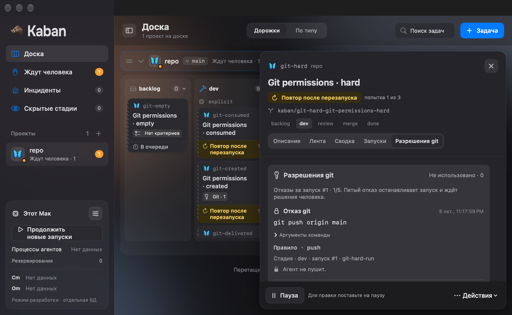

# FE-17: отказы git и разовые разрешения

8 октября 2026. Ветка `codex/fe-17-git-approvals`, база main `a20a48d`
([FE-16, PR #107](https://github.com/imedfan/kaban/pull/107)). Проверенный код
`9e08eb80a08954a1f221e2781821d493ee3fda92`; hashes PNG — в
[manifest кадров](screenshots/fe-17/frames.json).

## Поведение и владелец состояния

В деталях задачи появился раздел «Разрешения git» и структурированные строки
в ленте. Исходные argv доступны по отдельным аргументам; rule, stage/run,
timestamps и restrictions приходят от backend. Legacy context отсутствует —
разрешение недоступно, причина неизвестна. Hard invariant показывает lock без
кнопок разрешения. Пять настоящих отказов дают `waiting_human: git_denials`;
retry ставит ту же стадию в очередь.

Grant хранится в TaskDetail независимо от retention. Created, delivered,
consumed, revoked и expired показаны отдельно с backend timestamps; отсутствие
времени не заменяется локальными часами. Delivered означает уведомление агента,
а consumption возникает только при `/git/check`. Противоречивый legacy terminal
набор показан явно. Повтор allow не создаёт второй grant; завершённая задача и
отказ другой стадии возвращают `stale_git_denial`. Consumed нельзя отозвать,
consumed/revoked не получают дополнительный expiry. Authoritative taskUpdated
обновляет unused badge после создания, использования и отзыва.

BoardSession хранит command receipt/pending по denial/grant. `.ok` сам по себе
не разрешает команду. Подтверждение требует correlated предметного события;
чужой denial, project/scope или прежняя pipeline version не подтверждают intent.
Выбор другой задачи закрывает preview; фоновые task actions и создание задачи
недоступны за sheet. Core зависит только от Protocol.

## Постоянное правило

До сохранения sheet показывает project/stage scope, точный YAML и server-resolved
policy. Он использует существующие PipelineEditorStore, PipelineTextDocument,
file CAS и validation. Незавершённые edits `.kaban/` требуют сначала завершить
их в общем редакторе. Read-only, conditional и вышестоящие deny сохраняют силу;
stage scope привязан к стадии исходного отказа.

Ранее addDenialToPolicy записывал дополнительный запрет в DB и сообщал прежний
hash без YAML-коммита. Теперь optional PipelineDraft сохраняет wire-совместимость,
а команда без draft получает `pipeline_draft_required`. Старый DB writer/reader
удалён; миграция таблицы остаётся совместимой. Backend проверяет exact source,
явное allow/extend правило и новую версию, затем выполняет исходный envelope
через общий durable PipelineOperation. Git-коммит выполняется перед атомарной
DB-записью accepted pipeline, policy snapshot, journal и receipt. Recovery после сбоя за Git-коммитом
завершает тот же intent ровно один раз.

UI подтверждает сохранение после correlated gitPolicyUpdated, нового receipt
hash и повторного чтения matching committed bytes. Snapshot denial сохраняет
принятый hash, scope и resolved policy после reopen. Live run сохраняет frozen
policy; будущий run получает новую. Один same-version event не изображается
успешным постоянным разрешением.

## Проверки

Полный `KABAN_SCENARIOS=Scenarios/M1 swift test` прошёл: Transport 29, Protocol
69, Kit 180, DaemonCore 192, BoardCore 191 — 661 test без ошибок. После добавления
crash/recovery проверки финальный `--filter GitGrantTests` прошёл: 15 tests.
Четыре lifecycle регрессии сначала воспроизведены красными tests. Project/stage
правила проверены реальным Git-коммитом с сохранением комментария, повтором
commandId, новым run и reopen. Legacy DTO, pending/correlation и exact editor
проверены существующими suites и тремя GitPermissionsTests.

Unsigned App build, context checker и diff check прошли. Native driver проверил
17 запусков настоящего WindowGroup с production daemon через private stdio:
allow/revoke, restart, created/empty/delivered/consumed/expired, hard/unknown/stale,
длинные argv, два scope preview, Escape, Cmd-Return commit, retry и disconnected.
Проверены light/dark, 1440×900 и 1040×640. История grant видна без перекрытия
model block. Cmd-Return обработан настоящим AppKit menu shortcut, Escape — shortcut
sheet. Обычный Return зависел от активации QA-процесса и не входит в финальный
стабильный прогон; физический pointer и системная ручная keyboard приёмка не проверены.

[Результаты сценариев](screenshots/fe-17/checks.json) и
[manifest кадров](screenshots/fe-17/frames.json) сохраняют проверки и PNG hashes.







Seed использует публичный production store и настоящий loopback `/git/check`,
а не внедрённые denial/grant rows. Для повторения сначала собрать App в
`/tmp/kaban-fe17-app` и package через `swift build`, затем из корня:

```sh
swiftc tools/seed-git-permissions.swift \
  -I .build/out/Products/Debug \
  -I .build/checkouts/GRDB.swift/Sources/GRDBSQLite \
  .build/out/Products/Debug/KabanProtocol.o .build/out/Products/Debug/KabanKit.o \
  .build/out/Products/Debug/KabanDaemonCore.o .build/out/Products/Debug/KabanTransport.o \
  .build/out/Products/Debug/GRDB.o -lsqlite3 -o /tmp/kaban-fe17-seed
python3 tools/check-git-permissions.py
```

## Границы

Mac поставлен на паузу; recovery seed runs и private stdio не запускали Cursor
или hooks. Следующий Cursor-промпт ещё не получает grant: producer `.nextPrompt`
отсутствует, [пробел UC-17/архитектуры §8.3](frontend-backend-integration-gaps.md)
остаётся открытым. Доставка через MCP проверена; UI не подменяет её промптом.
Installed helper/XPC, signed folder grants, physical pointer и VoiceOver
не проверены. Независимое ревью не выполнялось; собственный разбор охватил
контракты, корреляцию, selection, lifecycle, exact-file apply и recovery.
Полный M1/MVP не принят. Следующая задача очереди — FE-18.
