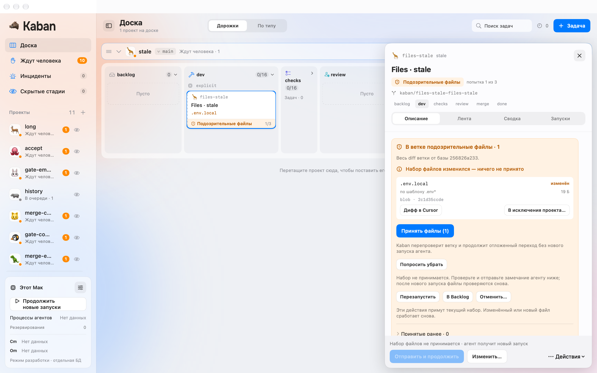
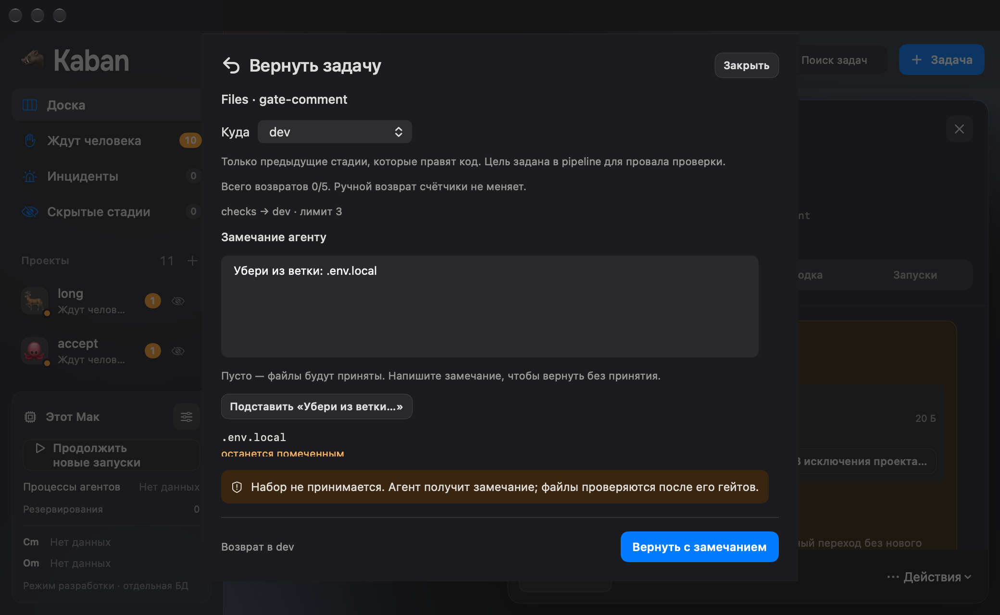
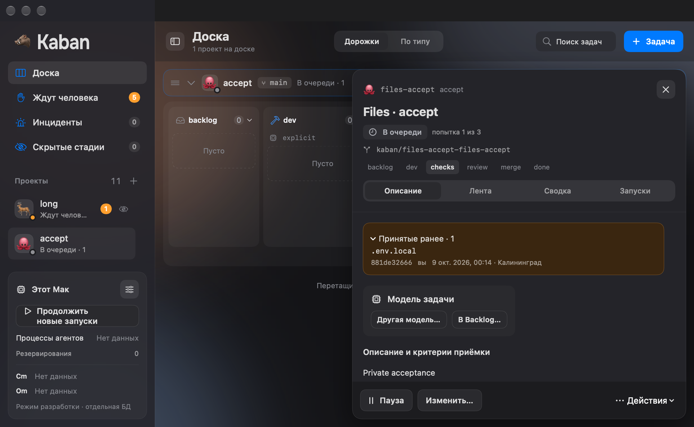

# FE-18: подозрительные файлы и явные решения

9 октября 2026. Ветка `codex/fe-18-suspicious-files`, база main `a20a48d`
([FE-16, PR #107](https://github.com/imedfan/kaban/pull/107)). Код
`0cba1fe9e4d4c6ad78b0cc919566f3910f152f2c`.

## Поведение

В настоящей панели задачи появился янтарный блок подозрительных файлов:
точный путь, правило, размер, text/blob и база проверки. Он расположен перед
материалами и моделью; состояние сохраняется после reopen. История принятого
набора показывает actor и backend time в Europe/Kaliningrad. Эти файлы не
становятся красными инцидентами и не увеличивают openIncidentCount.

«Принять файлы» отправляет ровно показанные path+blob. `.ok` не меняет карточку
и не снимает pending; нужен correlated taskUpdated с пустым набором и выходом
из ожидания файлов. Изменившийся набор даёт спокойное inline-сообщение,
пометки «новый»/«изменён» и новое чтение деталей. Новый набор требует отдельного
нажатия; старый envelope не принимает его при replay.

Agent использует существующий draft answerHuman. «Попросить убрать» подставляет
точные пути и прокручивает панель к замечанию, сохраняя набор непринятым.
Gate/merge используют отдельный return sheet: пустой комментарий создаёт
moveTask и «Принять файлы и вернуть», непустой — requestChanges и «Вернуть с
замечанием» без acceptance. Цель приходит из on_fail/on_conflict сохранённого
pipeline задачи; read-only и последующие стадии недоступны. Ручной возврат
счётчики bounce не увеличивает. Предупреждение всегда видно рядом с кнопкой,
включая минимальный размер. Изменение результата не переносит сохранённое
замечание на новый набор без явного решения.

Retry, Backlog и cancel заранее показывают, что примут текущий набор по правилам
backend. Exceptions открывают общий редактор проекта с точным путём в YAML draft;
переход не записывает pipeline и не принимает файлы текущей задачи.

## Источник состояния и файловая граница

Ранее acceptance сравнивался только с сохранённым набором, а свежая проверка
выполнялась после записи accepted pairs. Production store теперь читает настоящий
diff перед решением, сверяет неизменность task snapshot и атомарно записывает
обновлённую находку, journal и refusal receipt. Чужое observation commandId
не подтверждает отказанный человеческий intent. Отсутствующий клон или ошибка
чтения не принимают набор. Повтор envelope возвращает durable receipt до чтения Git.

Optional TaskDetail.fileCheck сообщает порог, Strict, base commit, общий bounce
limit и frozen return pipeline. Legacy required поля остаются required. Без
новых фактов порог неизвестен и return action недоступен; UI не подставляет
размер или маршрут из изменённого pipeline проекта.

Git diff и numstat разбираются по NUL с --no-renames: scanner видит удаление
старого и добавление точного нового пути. Это исправляет quoted Unicode,
табы, переводы строк и binary rename. Strict untracked paths также читаются
без trimming первого имени.

Малый текстовый файл открывается в Cursor; бинарный, крупный или файл с
неизвестным порогом — в Finder. Проверка идёт относительно clone root через
openat/O_NOFOLLOW для каждого компонента; traversal, ссылки, каталог и удалённый
файл получают явную ошибку. Между проверкой и внешним NSWorkspace остаётся
обычная гонка изменения файловой системы; атомарное внешнее открытие не заявляется.

## Проверки

Полный `KABAN_SCENARIOS=Scenarios/M1 swift test` прошёл: Transport 29,
Protocol 69, Kit 180, DaemonCore 189, BoardCore 196 — 663 tests без ошибок.
Узкие IncidentTests (8), BoardCore
SuspiciousFilesTests (8), RoundTripTests (14) и Kit scanner tests (3) прошли.
Четыре stale сценария, quoted path и замена project pipeline сначала
воспроизведены красными tests; затем проверены исправления. Unit suites
проверяют replay, exact-set correlation, draft retargeting, legacy decoding,
порог preview, traversal, ссылки и отсутствие клона. App build прошла.

Native driver прошёл 22 запуска настоящего WindowGroup с production daemon
через private stdio: актуальный приём без нового run, stale blob, gate/merge
empty/comment previews и реальные возвраты, Escape, reopen, длинный Unicode
путь/замечание/прокрутка, отсутствующий клон, binary/Finder, открытие Cursor,
общий exceptions draft, Strict и disconnected. Проверены light/dark,
1440×900 и 1040×640. Native report подтверждает неизменность incident count
и освобождение writer lease после каждого процесса.

[Результаты сценариев](screenshots/fe-18/checks.json) и
[PNG hashes](screenshots/fe-18/frames.json) сохраняют source SHA и размер кадров.
Кадры сняты из настоящего WindowGroup.






Native QA закрывает private transport и ждёт дочерний процесс перед exit;
driver проверяет освобождение writer lease после каждого запуска без ретраев.

Для повторения собрать App в `/tmp/kaban-fe18-app`, выполнить `swift build`, затем:

```sh
swiftc tools/seed-suspicious-files.swift \
  -I .build/out/Products/Debug \
  -I .build/checkouts/GRDB.swift/Sources/GRDBSQLite \
  .build/out/Products/Debug/KabanProtocol.o .build/out/Products/Debug/KabanKit.o \
  .build/out/Products/Debug/KabanDaemonCore.o .build/out/Products/Debug/KabanTransport.o \
  .build/out/Products/Debug/GRDB.o -lsqlite3 -o /tmp/kaban-fe18-seed
python3 tools/check-suspicious-files.py
```

## Границы

Mac в private fixture поставлен на паузу. Seed использует публичный production
store, настоящие Git clones и stage/merge checks; Cursor CLI и hooks не запускались.
Текстовый файл открыт в установленном Cursor через NSWorkspace, бинарный —
через Finder. Содержимое окна внешнего редактора не захватывалось.
Cmd-Return и Escape проверены через настоящие AppKit shortcuts; физическая
клавиатура, pointer и VoiceOver не проверены. Signed folder grants, installed
helper/XPC и adversarial filesystem race остаются в системной приёмке.
Независимое ревью не выполнялось; собственный разбор охватил frozen context,
корреляцию, replay, lifecycle, stage-specific действия и файловые границы.
Полный M1/MVP не принят. Следующая задача — FE-19.
